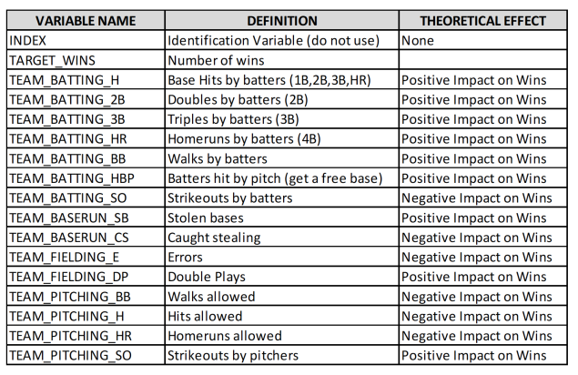

```{r setup, include=FALSE}
knitr::opts_chunk$set(echo = TRUE)
```

\newpage

## Dataset



## Overview

+---------------------------------------------------------------------------------------------------------------------------------------------------------------------------------------------------------------------------------------------------------------------------------------------------------------------------------------------------------------------+
| ##                                                                                                                                                                                                                                                                                                                                                                  |
|                                                                                                                                                                                                                                                                                                                                                                     |
| In many sports scoring more points than you give up is the recipe for success. That is certainly the recipe for baseball where a winning team will typically have greater runs scored over a season than runs that they allow. We will attempt to predict the number of wins on the team.                                                                           |
|                                                                                                                                                                                                                                                                                                                                                                     |
| \-                                                                                                                                                                                                                                                                                                                                                                  |
|                                                                                                                                                                                                                                                                                                                                                                     |
| We will first explore the data looking for issues or challenges (i.e. missing data, outliers, possible coding errors, multicollinearlity, etc). Once we have a handle on the data, we will apply any necessary cleaning steps. Once we have a reasonable dataset to work with, we will build and evaluate three different linear models that predict seasonal wins. |
|                                                                                                                                                                                                                                                                                                                                                                     |
| \-                                                                                                                                                                                                                                                                                                                                                                  |
|                                                                                                                                                                                                                                                                                                                                                                     |
| Our dataset includes both training data and evaluation data - we will train using the main training data, then evaluate models based on how well they perform against the holdout evaluation data. Finally we will select a final model that offers the best compromise between accuracy and simplicity.                                                            |
|                                                                                                                                                                                                                                                                                                                                                                     |
| \-                                                                                                                                                                                                                                                                                                                                                                  |
+---------------------------------------------------------------------------------------------------------------------------------------------------------------------------------------------------------------------------------------------------------------------------------------------------------------------------------------------------------------------+

| \newpage

## 1. Data Exploration

In this report, we will explore, analyze and model a data set containing approximately 2200 records. We will describe the size and the variables in the moneyball training data set.

Each record represents a professional baseball team from the years 1871 to 2006 inclusive. Each record has the performance of the team for the given year, with all of the statistics adjusted to match the performance of a 162 game season

### Objective

-   Understand the variables provided

-   Build a multiple linear regression model on the training data

-   predict the number of wins for the team.

```{r packages, echo=FALSE, warning=FALSE, message=FALSE}
library(tidyverse)
library(skimr)
library(tinytex)
library(corrplot)
library(corrr)
library(GGally)
library(VIM)
library(broom)

```

```{r data, echo=FALSE, warning=FALSE, message=FALSE}

ball_test <- read_csv("https://raw.githubusercontent.com/mgino11/Business_Analytics/main/Projects/PROJECT_HW1/moneyball-evaluation-data.csv")

ball_train <- read_csv("https://raw.githubusercontent.com/mgino11/Business_Analytics/main/Projects/PROJECT_HW1/moneyball-training-data.csv")
```

Lets first look at the raw data values by using the skim package

```{r edt, echo=FALSE}

ball <- ball_train %>% 
  select(TARGET_WINS, TEAM_BATTING_H, TEAM_BATTING_2B, TEAM_BATTING_3B,TEAM_BATTING_BB,TEAM_BATTING_HR, TEAM_BATTING_SO, TEAM_BASERUN_SB, TEAM_BASERUN_CS, TEAM_BATTING_HBP, TEAM_PITCHING_H, TEAM_PITCHING_HR, TEAM_PITCHING_BB, TEAM_PITCHING_SO, TEAM_FIELDING_E, TEAM_FIELDING_DP)

```

```{r, message=FALSE, warning=FALSE}
skim(ball)
```

Observe that we have several variables with missing values. `TEAM_BATTING_SO, BASERUN_SB, BASERUN_CS, PITCHING_SO, FIELDING_DP, BATTING HBP.`

------------------------------------------------------------------------

| 

\newpage

### Distributions

The distribution of our variables refers to how the different values are spread-out across observations. This distributions gives us a sense of what the most common values are for a given variable and how much this values vary.

The distribution of our variables can also alert us of of unusual patterns, in this case we have observed the prevalence of kurtosis for certain variables like: (right skewed) BASERUN_SB, BASERUN_CS, PITCHING_H, PITCHING_BB and PITCHING_SO.

After creating independent histograms for each variable we have found 2 variables that appear to be bi-modal. We notice that the graphs of this variables have two distinct humps or peaks with a valley separating them. We could attribute this observations to possibly different groups or the existence of NA's in the data.

| Variable         | Type              |
|------------------|-------------------|
| TEAM_BATTING_SO  | BIMODAL           |
| TEAM_PITCHING_HR | BIMODAL (no NA's) |

We have no data linking rows with specific years. We might attempt to locate additional data sets that link performance to year and leverage change point detection to see if bimodal relationships are linked with all teams at specific points in time. If change points are present, that suggests something changed affecting all teams (e.g. new rules that improved or lowered the bimodal feature). We would then create a new categorical feature indicating which class the row data came from, before or after the change point.

```{r echo=FALSE, warning=FALSE}
ball_dist <- ball %>% 
  pivot_longer(
    everything(),
    names_to = c("variable"),
    values_to = "value"
  )
```

```{r, echo=FALSE, fig.height=10,fig.width=10, message=FALSE, warning=FALSE}
ggplot(ball_dist, aes(value)) + 
  geom_histogram(aes(x=value, y = ..density..), 
                 colour = 4, bins = 30) +
  geom_density(aes(x=value), color = "red") +
  facet_wrap(~variable, scales = "free")
```

\newpage

### Outliers

In addition to histogram graph of our variable we thought it was pertinent to take a look at our variables using a boxplot. It will help us quickly visualize the distribution of the values in the dataset and see where the five number summary values are located.

In addition, we will be able to create a clear picture of the median values and the spreads across all the distributions. One of the most important observation we will obtain from this graph however, is outlier detection.

Before we start fitting our data to the model we will have to determine the validity of the data-points corresponding to bad leverage points (outliers). We can observe that variables like TEAM_BATTING_3B, TEAM_PITCHING_BB, TEAM_PITCHING_H, TEAM_PITCHING_SO have outliers. Are these data points unusual or different in some way from the rest of the data? We will have to consider removing this and refit the data if we consider they could be affecting our results.

**We shall follow the common practice of labeling points as outliers in small- to moderate-size data sets if the standardized residual for the point falls outside the interval from --2 to 2.**

In summary, an outlier is a point whose standardized residual falls outside the interval from --2 to 2. Recall that a bad leverage point is a leverage point which is also an outlier. Thus, a bad leverage point is a leverage point whose standardized residual falls outside the interval from --2 to 2. On the other hand, a good leverage point is a leverage point whose standardized residual falls inside the interval from --2 to 2 .

```{r, echo=FALSE, fig.height=10, fig.width=10,message=FALSE, warning=FALSE}

ggplot(ball_dist, aes(variable, value)) +
  geom_boxplot() + 
  facet_wrap(~variable, scales = "free", ncol = 5)
```

\newpage

### Relationships

We want use scatter plots in each variable versus the target variable, TARGET_WINS to get an idea of the relationship between them. Consider we have not dealt with missing data yet.

The plots indicate interesting relationship between the variable TARGET_WINS, however mostly they indicate issues with our data.

Most of the predictors variables are skewed and not normally distributed, in addition we have several variables with significant portions of the data missing or NA.

The pitching variables include many 0's for instance there are multiple teams with 0 strikeouts by their pitchers over the season which is very unlikely. On the other side of the spectrum for the pitching variables, we find the PITCHING_H with 20k strikeouts. That would be an average of 160 strikeouts per game which is impossible.

```{r, echo=FALSE, message=FALSE, warning=FALSE}
ball_scatter <- ball %>% 
  pivot_longer(
    starts_with("TEAM"),
    names_to = c("variable"),
    values_to = "value"
  )
```

```{r, echo=FALSE, fig.height=10, fig.width=10, warning=FALSE}
ggplot(ball_scatter, aes(x = value, y = TARGET_WINS )) +
  geom_point() + 
  facet_wrap(~variable, scales = "free", ncol = 4)


```

\newpage

### Missing Data

When we initially displayed the data summary we were able to observe the evidence of missing data. Now we take a closer look and we can see that there are several variables with high percentage of missing values.

Notice that TEAM_BATTING_HBP has 91.6% of its data missing, making this variable unusable for analysis. We will proceed and eliminate this variable. The next high percentage of missing data is in TEAM_BASERUN_CS(34%), according to baseball history, stolen bases were not tracked officially until 1887. We could assume that some of the missing data is accounted from 1871-1886.

For the rest of the variables with low percentages of missing values we will proceed to impute the missing values by replacing the missing value of a predictor with the average value of the predictor.

```{r, echo=FALSE, warning=FALSE, message=FALSE}
ball_na <- ball %>% 
  pivot_longer(
    everything(),
    names_to = c("variable"),
    values_to = "value" ) %>% 
  mutate(is.missing = is.na(value)) %>% 
  group_by(variable, is.missing) %>% 
  summarise(num.missing = n()) %>% 
  filter(is.missing==T) %>% 
  select(-is.missing) %>% 
  arrange(desc(num.missing))
```

```{r, echo=FALSE}
ball_na %>% 
  ggplot() +
  geom_bar(aes(x=variable, y=num.missing), stat = 'identity') + 
  labs(x='variable', 
       y="number of NA's", 
       title = "Number of missing values") +
  theme(axis.text = element_text(angle = 45,, hjust = 1))

```

```{r, echo=FALSE, message=FALSE, warning=FALSE}
ball_na <- ball %>% 
  pivot_longer(
    everything(),
    names_to = c("variable"),
    values_to = "value" ) %>% 
  mutate(isna = is.na(value)) %>% 
  group_by(variable) %>% 
  mutate(total = n()) %>% 
  group_by(variable,total,isna) %>% 
  summarise(num.isna = n()) %>% 
  mutate(pct = num.isna / total * 100)

```

```{r, results='asis'}
knitr::kable(ball_na)
```

\newpage

## 2. Data Preparation

| Data Preparation   | Action Taken                                            |
|--------------------|---------------------------------------------------------|
| Rename Variables   | Drop the word TEAM for readability                      |
| Remove Variables   | Remove BATTING_HBP since it was missing 90% of its data |
| Missing Data       | Data Imputation - median values                         |
| Data Normalization | Standardization (Z-score normalization)                 |

```{r, echo=FALSE}

ball_clean <- ball %>% 
  select(-TEAM_BATTING_HBP) %>% 
  rename_with(~ sub("TEAM_", "", .x), starts_with("TEAM"))


```

### Mean Imputation

One of the simplest imputation methods is the mean imputation. It boils down to simply replacing the missing values for each variable with the mean of its observed values. Mean imputation can work well for time-series data that randomly fluctuate around some long-term average, such as stock price changes. However, some practitioners treat mean imputation as a default go-to method also for cross-sectional data, forgetting that it is often a very poor choice. Mean imputation has two major drawbacks: it destroys the relations between the variables and provides no variance in the imputed data.

A final remark: instead of the mean, one might impute with a median or a mode. Median imputation could be a better choice when there are outliers in the data. In such cases, the mean can be driven arbitrarily large or small with even a single outlier, while the median will stay closer to most of the data.

```{r}
#Create Binary indicators for whether each value was originally missing 
ball_imp <- ball_clean %>% 
  mutate(BASERUN_CS_imp = ifelse(is.na(BASERUN_CS), T, F)) %>% 
  mutate(BASERUN_SB_imp = ifelse(is.na(BASERUN_SB), T, F)) %>%
  mutate(BATTING_SO_imp = ifelse(is.na(BATTING_SO), T, F)) %>%
  mutate(FIELDING_DP_imp = ifelse(is.na(FIELDING_DP), T, F)) %>%
  mutate(PITCHING_SO_imp = ifelse(is.na(PITCHING_SO), T, F))


```

```{r ball_imp}
# Replace mising values in all 5 variables with their respective median
ball_imp <- ball_imp %>% 
  mutate(BASERUN_CS = ifelse(is.na(BASERUN_CS), 
                             median(BASERUN_CS, na.rm = T), 
                             BASERUN_CS)) %>% 
  mutate(BASERUN_SB = ifelse(is.na(BASERUN_SB),
                             median(BASERUN_SB, na.rm = T),
                             BASERUN_SB)) %>%
  mutate(BATTING_SO = ifelse(is.na(BATTING_SO),
                             median(BATTING_SO, na.rm = T),
                             BATTING_SO)) %>%
  mutate(FIELDING_DP = ifelse(is.na(FIELDING_DP),
                              median(FIELDING_DP, na.rm = T),
                              FIELDING_DP)) %>%
  mutate(PITCHING_SO = ifelse(is.na(PITCHING_SO), 
                              median(PITCHING_SO, na.rm = T),
                              PITCHING_SO))

```

Median Imputed data

```{r, echo=FALSE}
ball_imp %>% 
  select(BASERUN_SB, BASERUN_SB_imp, BASERUN_CS,BASERUN_CS_imp, BATTING_SO, BATTING_SO_imp, FIELDING_DP, FIELDING_DP_imp, PITCHING_SO, PITCHING_SO_imp) %>% head()

```

### Data Normalization

$x' = x-mu/ tetha$

Min-max scaling is a very common way to normalize the data. It scales every feature value between its minimum and maximum. In the scaled version, the minimum value is mapped to zero, the maximum is mapped to one and the rest of the values lie in between.\

Another popular method is called standardization or Z-score normalization. It represents a numerical value as units of a standard deviation from the feature mean. As a result, values below the mean will be mapped to negative units and values above the mean will be mapped to positive units.

To summarize, min-max normalization ensures that all features will share the exact same scale but does not cope well with outliers. Z-score normalization, on the other hand, is more robust to outliers but produces normalized values in different scales.

Just to provide a brief example of the logic to be applied in all the variables that are not normal we will use the imputed variables (no NA's) to normalize them by using the z_score approach. As we can see in the example below once we use the imputed variable to create a normalized one the histogram showing its distribution has been normalized.

```{r ball_norm}
ball_norm <- ball_imp %>% 
  mutate(BASERUN_CS_z = (
    BASERUN_CS - mean(BASERUN_CS))/sd(BASERUN_CS))
```

```{r, fig.height=3, fig.width=3, echo=FALSE}
# skewed varaible not normalized 
hist(ball_norm$BASERUN_CS)
```

```{r, echo= FALSE, fig.height=3, fig.width=3}
# histogram normalized variable
hist(ball_norm$BASERUN_CS_z)
```

```{r, echo=FALSE}
ball_norm <- ball_imp %>% 
  mutate(BASERUN_CS_z = (
    BASERUN_CS - mean(BASERUN_CS))/sd(BASERUN_CS)) %>% 
  mutate(BASERUN_SB_z = (
    BASERUN_SB - mean(BASERUN_SB)) / sd(BASERUN_SB)) %>% 
  mutate(BATTING_3B_z = (
    BATTING_3B - mean(BATTING_3B)) / sd(BATTING_3B)) %>% 
  mutate(BATTING_H_z = (
    BATTING_H - mean(BATTING_H)) / sd(BATTING_H)) %>% 
  mutate(BATTING_SO_z = (
    BATTING_SO - mean(BATTING_SO)) / sd(BATTING_SO)) %>% 
  mutate(FIELDING_E_z = (
    FIELDING_E - mean(FIELDING_E)) / sd(FIELDING_E)) %>%
  mutate(PITCHING_BB = (
    PITCHING_BB - mean(PITCHING_BB)) / sd(PITCHING_BB)) %>% 
  mutate(PITCHING_H_z = (
    PITCHING_H - mean(PITCHING_H)) / sd(PITCHING_H)) %>% 
  mutate(PITCHING_HR_Z = (
    PITCHING_HR - mean(PITCHING_HR)) / sd(PITCHING_HR)) %>% 
  mutate(PITCHING_SO_z = (
    PITCHING_SO - mean(PITCHING_SO)) / sd(PITCHING_SO))
```

### Normalized Distributions

```{r, echo=FALSE}
ball_norm_z <-ball_norm %>% 
  select(ends_with("z")) %>% 
  pivot_longer(
    everything(),
    names_to = c("variable"),
    values_to = "value")

```

```{r}
ggplot(ball_norm_z, aes(value)) + 
  geom_histogram(aes(x=value, y = ..density..), 
                 colour = 4, bins = 30) +
  geom_density(aes(x=value), color = "red") +
  facet_wrap(~variable, scales = "free")
```

\newpage

### Clean Data

```{r}
# Build clean dataframe with all transformations
df_clean <- ball %>% 
  select(-TEAM_BATTING_HBP) %>% 
  rename_with(~ sub("TEAM_", "", .x), starts_with("TEAM")) %>% 
  mutate(BASERUN_CS = ifelse(is.na(BASERUN_CS), 
                             median(BASERUN_CS, na.rm = T), 
                             BASERUN_CS)) %>% 
  mutate(BASERUN_SB = ifelse(is.na(BASERUN_SB),
                             median(BASERUN_SB, na.rm = T),
                             BASERUN_SB)) %>%
  mutate(BATTING_SO = ifelse(is.na(BATTING_SO),
                             median(BATTING_SO, na.rm = T),
                             BATTING_SO)) %>%
  mutate(FIELDING_DP = ifelse(is.na(FIELDING_DP),
                              median(FIELDING_DP, na.rm = T),
                              FIELDING_DP)) %>%
  mutate(PITCHING_SO = ifelse(is.na(PITCHING_SO), 
                              median(PITCHING_SO, na.rm = T),
                              PITCHING_SO)) %>% 
  mutate(BASERUN_CS = (
    BASERUN_CS - mean(BASERUN_CS))/sd(BASERUN_CS)) %>% 
  mutate(BASERUN_SB = (
    BASERUN_SB - mean(BASERUN_SB)) / sd(BASERUN_SB)) %>% 
  mutate(BATTING_3B = (
    BATTING_3B - mean(BATTING_3B)) / sd(BATTING_3B)) %>% 
  mutate(BATTING_H = (
    BATTING_H - mean(BATTING_H)) / sd(BATTING_H)) %>% 
  mutate(BATTING_SO = (
    BATTING_SO - mean(BATTING_SO)) / sd(BATTING_SO)) %>% 
  mutate(FIELDING_E = (
    FIELDING_E - mean(FIELDING_E)) / sd(FIELDING_E)) %>%
  mutate(PITCHING_BB = (
    PITCHING_BB - mean(PITCHING_BB)) / sd(PITCHING_BB)) %>% 
  mutate(PITCHING_H = (
    PITCHING_H - mean(PITCHING_H)) / sd(PITCHING_H)) %>% 
  mutate(PITCHING_HR = (
    PITCHING_HR - mean(PITCHING_HR)) / sd(PITCHING_HR)) %>% 
  mutate(PITCHING_SO = (
    PITCHING_SO - mean(PITCHING_SO)) / sd(PITCHING_SO))

```

```{r}
skim(df_clean)
```

### Multicolinearity

One problem that can occur with multi-variable regression is correlation between variables, or multicolinearity. A quick check is to run co linearity test.

```{r, echo=FALSE}
corrplot(corr = cor(df_clean, 
                    use = 'pairwise.complete.obs'),
         method = "ellipse",
         type = "upper",
         order = "original",
         tl.col = "black",
         tl.srt = 45,
         tl.cex = 0.55)
```

We can see that some variables are highly correlated with one another, such as PITCHING_BB and BATTING_BB. When we start considering features for our models, we'll need to account for the correlations between features and avoid including pairs with strong correlations.

Many features are also inherently associated, for example, as batter strike outs increase, we would expect a decrease in hit metrics. As Base Hits increase, we would expect to see increases in the 2B, 3B and 4B columns, etc.

\newpage

### Correlation

In order to determine the best predictor for our model we need to detect which are the predictor variables with low correlation value. We use the corrr package to determine all the variables with values \<0.10. This will allow us to only manipulate the variables that have significance to our model.

```{r, echo=FALSE, message=FALSE, warning=FALSE}
clean_cor <- correlate(df_clean)

```

```{r, }

clean_cor %>% 
  focus(TARGET_WINS) %>% 
  fashion()
  
```

Resolution.

We have determined that there are 6 predictor variables that we could eliminate due to their low correlated value.

These variables are:

| Excluded Variables | Correlation |
|--------------------|-------------|
| BATTING_SO         | -0.0306     |
| BASERUN_CS         | 0.0160      |
| PITCHING_H         | -0.110      |
| PITCHING_SO        | -0.0758     |
| FIELDING_E         | -0.176      |
| FIELDING_DP        | -0.0301     |

\newpage

### Log10 Transform

Now that we have determined Multicolinearity and Correlation we were able to determine which variables we should choose for our model.

we could look at our data composition and relationship with TARGET_WINS.

Let's transform the values in our data frame by adjusting log10 on right skwed variables; this is due to all predictor variables having the same units and are basically counts.

```{r, echo=FALSE, warning=FALSE}
final_clean <- df_clean %>% 
  select(-BATTING_SO,
         -BASERUN_CS,
         -PITCHING_H,
         -PITCHING_SO,
         -FIELDING_E,
         -FIELDING_DP)

```

```{r, echo=FALSE}
final_clean <-final_clean %>% 
  mutate(BATTING_H = log10(BATTING_H)) %>% 
  mutate(BATTING_3B = log10(BATTING_3B)) %>% 
  mutate(BATTING_HR = log10(BATTING_HR)) %>% 
  mutate(BASERUN_SB = log10(BASERUN_SB)) %>% 
  mutate(PITCHING_BB = log10(PITCHING_BB)) %>% 
  mutate(PITCHING_HR = log10(PITCHING_HR))

```

```{r, echo=FALSE}
final_scatter <- final_clean %>% 
  pivot_longer(
    cols = BATTING_H:PITCHING_BB,
    names_to = c("variable"),
    values_to = "value"
  )
```

```{r, echo=FALSE}
ggplot(final_scatter, aes(x = value, y = TARGET_WINS )) +
  geom_point() + 
  facet_wrap(~variable, scales = "free", ncol = 4)
```

from the graphs above it seems that we still have to adjust some predictor variables because they have excessive outliers. Once we create our model utilizing the final clean data we will utilize the box cox method on our linear model to adjust.

\newpage

## 3. Building Models

Using the training data set, build at least three different multiple linear regression models, using different variables (or the same variables with different transformations). Since we have not yet covered automated variable selection methods, you should select the variables manually (unless you previously learned Forward or Stepwise selection, etc.). Since you manually selected a variable for inclusion into the model or exclusion into the model, indicate why this was done. Discuss the coefficients in the models, do they make sense? For example, if a team hits a lot of Home Runs, it would be reasonably expected that such a team would win more games. However, if the coefficient is negative (suggesting that the team would lose more games), then thatneeds to be discussed. Are you keeping the model even though it is counter intuitive? Why? The boss needs to know.

### Model \# 1

For the first approach we will utilize dataset provided ball_train with the established relevant variables. This model utilizes raw data , with no transformations, no normalization, no dealing with missing data (imputation).

We use this model for comparison purposes as its results will serve as comparison with the refined dataset we have created.

-   The initial regression model is

$$T_{wins} = 1.84 + 0.035BAT_H - 0.01BAT_{2B} + 0.06BAT_{3B} - 0.003BAT_{HR} + 0.05BAT_{BB} + 0.031BRUN_{SB} + 0.06PIT_{HR} - 0.02PIT_{BB}$$

-   The variable BATTING_H has the largest effect on Target wins since its regression coefficient is the largest

```{r m1, echo=FALSE, warning=FALSE, message=FALSE}

model_1 <- lm(TARGET_WINS ~ TEAM_BATTING_H + 
                 TEAM_BATTING_2B + 
                 TEAM_BATTING_3B + 
                 TEAM_BATTING_HR + 
                 TEAM_BATTING_BB + 
                 TEAM_BASERUN_SB + 
                 TEAM_PITCHING_HR + 
                 TEAM_PITCHING_BB, ball_train)

summary(model_1)
```

```{r}
confint(model_1)
```

-   Coefficients: We are able to see from this model that there are 7 predictors that are statistically significant in the calculation prediction of the target variable.

-   The estimates `(Estimate)` column gives you the change in y (TARGET_WINS) caused by each element of the regression, in this case BATTING_2B, BATTING_HR, and PTICHING_BB hold negative values.

\newpage

### Model \#2

For Model 2 we will use our final clean data set with all the transformations performed. Only this time we will use R sample to create a sample of our data.

-   The initial regression model is

$$T_{wins} = 60.10 + 5.53BAT_H - 0.002BAT_{2B} + 2.07BAT_{3B} + 0.07BAT_{HR} + 0.02BAT_{BB} + 1.94BRUN_{SB} - 1.17PIT_{HR} - 0.81PIT_{BB}$$

```{r}
library(rsample)
# Splitting the dataset into train/testing set with 80/20 split
set.seed(3)
df_split <- initial_split(df_clean, prop = 0.8)
df_train <- training(df_split)
df_test <- testing(df_split)
```

```{r, echo=FALSE, warning=FALSE, message=FALSE}
model_2 <- lm(TARGET_WINS ~ BATTING_H + 
                 BATTING_2B + 
                 BATTING_3B + 
                 BATTING_HR + 
                 BATTING_BB + 
                 BASERUN_SB + 
                 PITCHING_HR + 
                 PITCHING_BB, df_clean)

summary(model_2)

```

```{r}
confint(model_2)
```

-   Coefficients: We are able to see from this model that there are 7 predictors that are statistically significant in the calculation prediction of the target variable.

-   The estimates `(Estimate)` column gives you the change in y (TARGET_WINS) caused by each element of the regression, in this case BATTING_2B, BATTING_HR, and PTICHING_BB hold negative values not that different from our previous model with no data transformations.

-   Different from expected Doubles by batters has a negative impact towards winning in other words the BATTING_2B in the full model reduces the percentage of target wins by 0.002% and the same goes for PITCHING_HR (pitching home runs) by 1.17% and PITCHING_BB (walks allowed) by .0.81%

\newpage

### Model \#3

For Model 3 we will use our final clean data set with all the transformations performed. Only this time we will use our final_clean dataset that includes log10 for the variables that were right skewed.

```{r, echo=FALSE, warning=FALSE, message=FALSE}

model_3 <- lm(TARGET_WINS ~ BATTING_H + 
                 BATTING_2B + 
                 BATTING_3B + 
                 BATTING_HR + 
                 BATTING_BB + 
                 BASERUN_SB + 
                 PITCHING_HR + 
                 PITCHING_BB, final_clean)

```

```{r, echo=FALSE}
summary(model_3)
```

```{r}
confint(model_3)
```

-   Coefficients: We are able to see from this model that there are 3 predictors that are statistically significant in the calculation prediction of the target variable.

<!-- -->

-   The estimates `(Estimate)` column gives you the change in y (TARGET_WINS) caused by each element of the regression, in this case our slope intercept has turned negative and we can see more negative values.

-   Negative Intercept - This means that the expected value on your dependent variable will be less than 0 when all independent/predictor variables are set to 0.

-   If the **beta coefficient** is **negative**, the **interpretation** is that for every 1-unit increase in the predictor variable, the outcome variable will decrease by the **beta coefficient value**.

\newpage

## 4. Select Models

### Model_1 Testing

We should ensure that the model fitted meets this last assumption, the same variance, to maintain the model. The error term needs to be the same across all values of the independent variables.

```{r test1, echo=FALSE}
par(mfrow=c(2,2))
plot(model_1)
```

Here we can see that the residial errors are not constant across groups and they are not distributed evenly.

Look at the `Normal Q-Q` (top right) which under homoscedasticity it should show points along the line.

Even though it seems that the Normal Q-Q plot follows the data, we noticed the tails on both ends, this caused due to outliers most likely.

-   The strength of the fit of a linear model is commonly evaluated using $R^2$

-   It tells us what percentage of the variability in the response variable is explained by the model. The remainder of the variability is unexplained.

-   $R^2$ also called coefficient determination. Roughly 26% of the variability in target wins can be explained by the predictors.

```{r, echo=FALSE}
glance(model_1)


```

Roughly 26% of the variability in wins of baseball games can be explained by the predictors in this model.

\newpage

### Model_2 Testing

```{r, echo=FALSE}
par(mfrow=c(2,2))
plot(model_2)

```

```{r, echo=FALSE}

glance(model_2)

```

Here we can see that the residial errors are not constant across groups and they are not distributed evenly.

Look at the `Normal Q-Q` (top right) which under homoscedasticity it should show points along the line.

Even though it seems that the Normal Q-Q plot follows the data, we noticed the tails on both ends, this caused due to outliers most likely.

-   The strength of the fit of a linear model is commonly evaluated using $R^2$

-   It tells us what percentage of the variability in the response variable is explained by the model. The remainder of the variability is unexplained.

-   $R^2$ also called coefficient determination. Roughly 24.8% of the variability in target wins can be explained by the predictors which is less than our first model that used the data with no transformations

\newpage

### Model_3 Testing

```{r, echo=FALSE}
par(mfrow=c(2,2))
plot(model_3)
```

```{r, echo=FALSE}
glance(model_3)
```

Here we can see that the residual errors are not constant across groups and they are not distributed evenly.

Look at the `Normal Q-Q` (top right) which under homoscedasticity it should show points along the line, it shows an improvement from the other 2 previous models. However it does not shoe the points in the along the line.

Even though it seems that the Normal Q-Q plot follows the data, we noticed the tails on both ends, this caused due to outliers most likely. We can see clear evidence of outlier 1810 and 1085

-   The strength of the fit of a linear model is commonly evaluated using $R^2$

-   It tells us what percentage of the variability in the response variable is explained by the model. The remainder of the variability is unexplained.

-   $R^2$ also called coefficient determination. Roughly 92% of the variability in target wins can be explained by the predictors.

### Final Selection

Based on these analyses, Model 3 performed marginally better than Model 1 and Model 2 , it could be selected as the linear model of choice when looking at adjusted R2. However, there is greater statistical significance under the third model relative to the others and uses less unnecessary variables to compute our prediction without sacrificing much in terms of adjusted Rˆ2 value. Because of these factors, as well as its better adjustment for multicollinearity and log10 of skewed variables (we noticeably saw less sign-flipping in coefficients), model 3 would be the model of choice.

```{r, echo=FALSE}
new_df <- df_clean
new.predict <- predict.lm(model_3, new_df)
```

```{r}
plot(new.predict)
```

## References

## Apendix

```{r}
head(new.predict)
```
