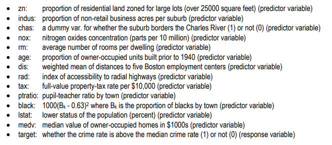

```{r setup, include=FALSE}
knitr::opts_chunk$set(echo = FALSE)
```

## Overview

In this homework assignment, you will explore, analyze and model a data set containing information on crime for various neighborhoods of a major city. Each record has a response variable indicating whether or not the crime rate is above the median crime rate (1) or not (0).

Your objective is to build a binary logistic regression model on the training data set to predict whether the neighborhood will be at risk for high crime levels. You will provide classifications and probabilities for the evaluation data set using your binary logistic regression model. You can only use the variables given to you (or variables that you derive from the variables provided). Below is a short description of the variables of interest in the data set:

## Dataset



\newpage

## 1. Data Exploration

```{r packages, echo=FALSE, warning=FALSE, message=FALSE}

library(tidyverse)
library(skimr)
library(tinytex)
library(e1071)
library(ggthemes)
library(caret)
```

```{r dataset, echo=FALSE, message=FALSE}
crime_train <- read_csv("https://raw.githubusercontent.com/mgino11/Business_Analytics/main/Projects/PROJECT_HW3/crime-training-data_modified.csv")

crime_eval <- read_csv("https://raw.githubusercontent.com/mgino11/Business_Analytics/main/Projects/PROJECT_HW3/crime-evaluation-data_modified.csv")
```

### Objective

-   Understand the variables provided

-   Build a binary logistic regression model on the training data

-   Predict the whether the neighborhood will be at risk for high crime.

-   Provide classifications and probabilities for the evaluation data set using logistic regression.

### Data Overview

Lets first look at the raw data values by using the skim package

```{r}

skim(crime_train)

```

From the description seen by the skim package we can observe we have two variables that should be transformed into factors since they have (1) or (0) values. `chas & target.`

\newpage

### Distributions

We will first explore the data looking for issues or challenges (i.e. missing data, outliers, possible coding errors, multicollinearlity, etc). Once we have a handle on the data, we will apply any necessary cleaning steps. Once we have a reasonable dataset to work with, we will build and evaluate three different Logistic models that predict seasonal wins.

```{r}

crime_dist <- crime_train %>% 
  pivot_longer(
    everything(),
    names_to = c("variable"),
    values_to = "value"
  )
```

```{r}

ggplot(crime_dist, aes(value)) + 
  geom_histogram(aes(x=value, y = ..density..), 
                 colour = 4, bins = 30) +
  geom_density(aes(x=value), color = "red") +
  facet_wrap(~variable, scales = "free")

```

The distribution of our variables can also alert us of of unusual patterns, in this case we have observed the prevalence of kurtosis for certain variables like:, `nox, Istat`, `rad, zn` are skewed to the right. In addition, `ptratio` and `age` are left skewed.

After creating independent histograms for each variable we have found 2 variables that appear to be bi-modal. We notice that the graphs of this variables have two distinct humps or peaks with a valley separating them. We could attribute this observations to possibly different groups. We find that `rad` and `tax` are bi-modal.

\newpage

### Outliers

In addition to histogram graph of our variable we thought it was pertinent to take a look at our variables using a boxplot. It will help us quickly visualize the distribution of the values in the dataset and see where the five number summary values are located.

In addition, we will be able to create a clear picture of the median values and the spreads across all the distributions. One of the most important observation we will obtain from this graph however, is outlier detection.

```{r}
ggplot(crime_dist, aes(value, variable)) + 
  geom_boxplot(outlier.color = "red") +
  facet_wrap(~variable, scales = "free", drop = FALSE)+
  coord_flip()
```

\newpage

### Relationships

\newpage

## 2. Data Preparation

```{r prep, echo=FALSE,message=FALSE,warning=FALSE}

crime_train$chas <- factor(crime_train$chas)
crime_train$target <- factor(crime_train$target)

```

\newpage

## 3. Building Models

### Model \# 1

\newpage

### Model #2

\newpage

### Model #3

\newpage

## 4. Select Models

### Model_1 Testing

\newpage

### Model_2 Testing

\newpage

### Model_3 Testing

\newpage

### Final Selection

## References

## Apendix

```{r}
#{r ref.label=knitr::all_labels(). echo=TRUE, eval=FALSE}
```
