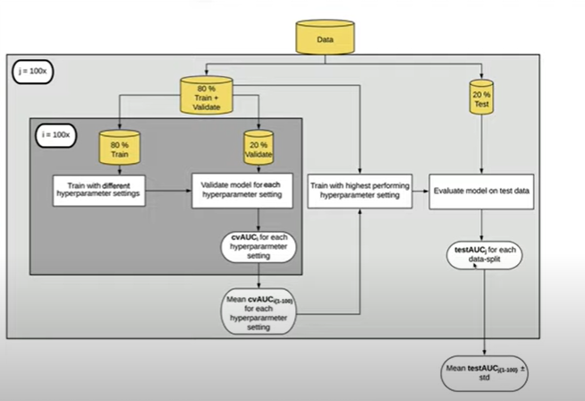

```{r setup, include=FALSE}
knitr::opts_chunk$set(echo = FALSE)
```

## Overview

In this homework assignment, you will explore, analyze and model a data set containing information on crime for various neighborhoods of a major city. Each record has a response variable indicating whether or not the crime rate is above the median crime rate (1) or not (0).

Your objective is to build a binary logistic regression model on the training data set to predict whether the neighborhood will be at risk for high crime levels. You will provide classifications and probabilities for the evaluation data set using your binary logistic regression model. You can only use the variables given to you (or variables that you derive from the variables provided). Below is a short description of the variables of interest in the data set:

## Dataset


\newpage

## 1. Data Exploration

```{r packages, echo=FALSE, warning=FALSE, message=FALSE}

library(tidyverse)
library(skimr)
library(tinytex)
library(e1071)
library(ggthemes)
library(caret)
```

```{r dataset, echo=FALSE, message=FALSE}
crime_train <- read_csv("https://raw.githubusercontent.com/mgino11/Business_Analytics/main/Projects/PROJECT_HW3/crime-training-data_modified.csv")

crime_eval <- read_csv("https://raw.githubusercontent.com/mgino11/Business_Analytics/main/Projects/PROJECT_HW3/crime-evaluation-data_modified.csv")
```

### Objective

-   Understand the variables provided

-   Build a binary logistic regression model on the training data

-   Predict the whether the neighborhood will be at risk for high crime.

-   Provide classifications and probabilities for the evaluation data set using logistic regression.

### Data Overview

Lets first look at the raw data values by using the skim package

```{r}

skim(crime_train)

```

From the description seen by the skim package we can observe we have two variables that should be transformed into factors since they have (1) or (0) values. `chas & target.`

\newpage

### Distributions

We will first explore the data looking for issues or challenges (i.e. missing data, outliers, possible coding errors, multicollinearlity, etc). Once we have a handle on the data, we will apply any necessary cleaning steps. Once we have a reasonable dataset to work with, we will build and evaluate three different Logistic models that predict seasonal wins.

```{r}

crime_dist <- crime_train %>% 
  pivot_longer(
    everything(),
    names_to = c("variable"),
    values_to = "value"
  )
```

```{r}

ggplot(crime_dist, aes(value)) + 
  geom_histogram(aes(x=value, y = ..density..), 
                 colour = 4, bins = 30) +
  geom_density(aes(x=value), color = "red") +
  facet_wrap(~variable, scales = "free")

```

The distribution of our variables can also alert us of of unusual patterns, in this case we have observed the prevalence of kurtosis for certain variables like:, `nox, Istat`, `rad, zn` are skewed to the right. In addition, `ptratio` and `age` are left skewed.

After creating independent histograms for each variable we have found 2 variables that appear to be bi-modal. We notice that the graphs of this variables have two distinct humps or peaks with a valley separating them. We could attribute this observations to possibly different groups. We find that `rad` and `tax` are bi-modal.

\newpage

### Outliers

In addition to histogram graph of our variable we thought it was pertinent to take a look at our variables using a boxplot. It will help us quickly visualize the distribution of the values in the dataset and see where the five number summary values are located.

In addition, we will be able to create a clear picture of the median values and the spreads across all the distributions. One of the most important observation we will obtain from this graph however, is outlier detection.

Find outliers in red below:

```{r}
ggplot(crime_dist, aes(value, variable)) + 
  geom_boxplot(outlier.color = "red") +
  facet_wrap(~variable, scales = "free", drop = FALSE)+
  coord_flip()
```

Indication of outliers is present in variables `chas`, `dis, Istat, medv, rm, zn`

A key is whether an outlier represents a contaminated observation or a rare case.

Are these data points unusual or different in some way from the rest of the data? We will have to consider removing this and refit the data if we consider they could be affecting our results.

One of the first steps in any type of analysis is to take a closer look at the observations that have high leverage since they could have a large impact on the results of a given model.

\newpage

### Relationships

We want use scatter plots in each variable versus the target variable to get an idea of the relationship between them.

The plots indicate interesting relationship between the `target` variable however some of them start showing signs of relationship and groups.

Some of the predictors variables are skewed and not normally distributed, in addition we have outliers and bimodality.

```{r, message=FALSE, warning=FALSE}
crime_scatter <- crime_train %>% 
  pivot_longer(
    cols = -target,
    names_to = c("variable"),
    values_to = "value")
```

```{r, message=FALSE, warning=FALSE}
ggplot(crime_scatter, aes(x = value, 
                          y = variable, 
                          color = as_factor(target))) +
  geom_jitter(position = position_jitterdodge(dodge.width = 0.8,
                                              jitter.width = 0.3),
             shape=21  )
```

We take some of the variables to be analyzed separately against the target

\newpage

### Skeweness

**Histogram of predictors by factors of target**

dis - weighted mean of distances to five Boston employment centers

```{r, message=FALSE, warning=FALSE}
crime_skew <- crime_train
  #convert target to factor and new names
  crime_skew$target <- recode_factor(
    crime_skew$target, '0' = 'low crime','1' = 'high crime' )

```

```{r, message=FALSE, warning=FALSE}
ggplot(crime_skew, aes(x=dis)) + 
  geom_histogram(fill = 'white', colour = 'black') + 
  facet_grid(target ~ .)
```

```{r, message=FALSE, warning=FALSE}
ggplot(crime_skew, aes(x=lstat)) + 
  geom_histogram(fill = 'white', colour = 'black') + 
  facet_grid(target ~ .)
```

```{r, message=FALSE, warning=FALSE}
ggplot(crime_skew, aes(x=zn)) + 
  geom_histogram(fill = 'white', colour = 'black') + 
  facet_grid(target ~ .)
```

Compared to other predictors we can observe that `zn`has a lot of zero values.

If there is a over dispersion of zeroes, where the peak of the curve is highest at zero we might have to consider a negative binomial. If zn is a significant predictor it could be an option to create negative binomial model using PSCL Package.

```{r, message=FALSE, warning=FALSE}
ggplot(crime_skew, aes(x=indus)) + 
  geom_histogram(fill = 'white', colour = 'black') + 
  facet_grid(target ~ .)
```

Indus - proportion of non retail business acres per suburb.

We can observe the skeweness of `indus` as well and look at the distribution by factors of target we can see high crime in 125 observations of indus.

\newpage

**Multicolinearity**

```{r, warning=FALSE, message=FALSE}

library(corrplot)

corrplot(corr = cor(crime_train, 
                    use = 'pairwise.complete.obs'),
         method = "ellipse",
         type = "upper",
         order = "original",
         tl.col = "black",
         tl.srt = 45,
         tl.cex = 0.55)
```

We can see that some variables are highly correlated with one another, such as `rad` & `tax`.

When we start considering features for our models, we'll need to account for the correlations between features and avoid including pairs with strong correlations.

Many features are also inherently associated, for example, as the distance to employment centers increase, we would expect a decrease in non-retail businesses acres, `nox` concentration and owner occupied units metrics. As median value owner-occupied homes increase, we would expect to see decreases in `lstat` - lower status of the population.

The target variable has linear correlation with `indus, nox, age, rad, tax and lstat`

\newpage

### Correlation

Earlier we discovered the correlation between tax and rad. We want to understand this relationship better by plotting them.

```{r}
plot(log(crime_train$tax), log(crime_train$rad))
```

The plot of correlation between rad and tax shoes 90% of the relationship is made by the influential points. This predictors are not really correlated.

```{r, warning=FALSE}
cor.test(crime_train$tax, crime_train$rad, method = "pearson")
```

Regarding the strength of the relationship: The **more extreme** the correlation coefficient (the closer to -1 or 1), the **stronger the relationship**. This also means that a **correlation close to 0** indicates that the two variables are **independent**, that is, as one variable increases, there is no tendency in the other variable to either decrease or increase.

The *p*-value of the correlation test between these 2 variables is 2.2e-16. At the 5% significance level, we do not reject the null hypothesis of no correlation. We therefore conclude that we do not reject the hypothesis that there is no linear relationship between the 2 variables.

This test proves that even if the correlation coefficient is different from 0 (the correlation is 0.9 in the sample), it is actually not significantly different from 0 in the population.

The larger the sample size and the more extreme the correlation (closer to -1 or 1), the more likely the null hypothesis of no correlation will be rejected. With a small sample size, it is thus possible to obtain a *relatively* large correlation in the sample (based on the correlation coefficient), but still find a correlation not significantly different from 0 in the population (based on the correlation test). For this reason, it is recommended to always perform a correlation test before interpreting a correlation coefficient to avoid flawed conclusions.

\newpage

## 2. Data Preparation

### Missing Data

To prepare our data we have already determined that we do not have any missing data in our dataset.

See below:

```{r, message=FALSE, warning=FALSE}
crime_na <- crime_train %>% 
  pivot_longer(
    everything(),
    names_to = c("variable"),
    values_to = "value" ) %>% 
  mutate(isna = is.na(value)) %>% 
  group_by(variable) %>% 
  mutate(total = n()) %>% 
  group_by(variable,total,isna) %>% 
  summarise(num.isna = n()) %>% 
  mutate(pct = num.isna / total * 100)
```

```{r}
knitr::kable(crime_na)
```

\newpage

### Correlation

In order to determine the best predictor for our model we need to detect which are the predictor variables with low correlation value. We use the corrr package to determine all the variables with values \<0.10. This will allow us to only manipulate the variables that have significance to our model.

```{r, warning=FALSE, message=FALSE}

library(corrr)
crime_corr <- correlate(crime_train,
                        use = "pairwise.complete.obs",
                        method = "spearman")
  
  
```

```{r}
crime_corr %>% 
  focus(target) %>% 
  fashion()
```

\newpage

### Preprocess



Lets take a look at our dataset now.

```{r, echo=FALSE}
crime_train %>% 
  group_by(target) %>% 
  summarise(count = n() ) %>% 
  mutate( prop = count / sum(count) )
```

| Crime Rate above median | Target var codes | Percent Frequency |
|-------------------------|:----------------:|:-----------------:|
| Yes                     |        1         |        51%        |
| No                      |        0         |        49%        |

```{r}
skim_without_charts(crime_train)
```

### **Partition**

The first thing we will do is to divide our training data into two parts: train set and test set. Our partition will be 70%, 30%

Caret provides us the `CreateDataPartition()` function for this, which will allow us to partition based on the proportion from the response variable.

```{r}
set.seed(1188)
trainIndex <- createDataPartition(crime_train$target, p = 0.7, list = F)
trainSet <- crime_train[trainIndex,]
testSet <- crime_train[-trainIndex,]
```

```{r}
skim_without_charts(trainSet)
```

\newpage

### **Hot Encoding**

Next we will use what is known as "one hot encoding" to transform the dummy variables. In our case we only have 1 - `chas`

The output will be a matrix of the predictors, which omits the response variable.

```{r}
dummyModel <- dummyVars(target ~ ., data = trainSet)
trainSet_X <- as.data.frame(predict(dummyModel, newdata = trainSet))
```

```{r}
skim_without_charts(trainSet_X)
```

\newpage

### **Normalization**

Typically we **normalize** data when performing some type of analysis in which we have multiple variables that are measured on different scales and we want each of the variables to have the same range.

This prevents one variable from being overly influential (in our case tax and rad), especially if it's measured in different units (i.e. if one variable is measured in inches and another is measured in yards).

```{r}
rangeModel <- preProcess(trainSet_X, method = "range")
trainSet_X <- predict(rangeModel, newdata = trainSet_X)
```

```{r}
skim_without_charts(trainSet_X)
```

Now we will make the final training set by adding this to our original response variable (target)

```{r}
trainSet <- cbind(trainSet$target, trainSet_X)
names(trainSet)[1] <- "target"
```

Our last step will be to transform the test set as well. We will use the same procedures.

-   One hot encoding - using the `dummyModel`

-   Normalization using `rangeModel`object

```{r}
testset_dummy <- predict(dummyModel, testSet)
testset_range <- predict(rangeModel, testset_dummy)
testset_range <- as.data.frame(testset_range)
testSet <- cbind(testSet$target, testset_range)
names(testSet) <- names(trainSet)
```

\newpage

### Feature Elimination

Nest thing that we need to consider is low information features. If uniformative, useless features are included in the dataset, this will almost always lead to a decrease in the model's performance.

In this case we will use the Recursive Feature Elimination. The function to implement this is the `rfe()`

Recursive Feature Elimination works by building many models of a type of machine learning method on the training set, and iteratively re-calculating the most important variables.

We will use the random forest approach to rank the features.

```{r, warning=FALSE, message=FALSE}


subset <- c(1:5, 7, 8, 9, 10, 12, 13)

set.seed(1188)

rfectrl <- rfeControl(functions = rfFuncs,
                      method = "cv",
                      verbose = F)

rfProfile <- rfe(x = trainSet[,2:13],
                 y = trainSet$target,
                 sizes = subset,
                 rfeControl = rfectrl)


```

```{r}
rfProfile
```

| Top 5 Variables to Use |
|:----------------------:|
|          nox           |
|          rad           |
|         indus          |
|          tax           |
|          dis           |

\newpage

## 3. Building Models

-   Dependent Variable: Whether or not the crime rate is above median crime rate

-   Independent variables: all predictors described earlier.

| Top 5 Variables to Use |
|:----------------------:|
|          nox           |
|          rad           |
|         indus          |
|          tax           |
|          dis           |

### Model \# 1

We will begin our first model using all the predictors to see the level of significance of each one of them. This model will include original tax and all the variables in the dataset

**Logit Model**

```{r logit}
logit<- glm(formula = trainSet$target ~ trainSet$nox + 
      trainSet$indus + 
      trainSet$rad + 
      trainSet$tax + 
      trainSet$dis,
    family = "binomial"
    (link = "logit"))
```

```{r}
summary(logit)

```

+-----------------------------------------+--------------------+------------+
| Crime Rate Above median                 | Logit Coefficients | Std. Error |
+=========================================+:==================:+:==========:+
| indus                                   | 0.4585             | 1.5864     |
|                                         |                    |            |
| (prop non-retail business acres/suburb) |                    |            |
+-----------------------------------------+--------------------+------------+
| nox                                     | 18.2624            | 3.6618     |
|                                         |                    |            |
| (nitrogen oxide concentration)          |                    |            |
+-----------------------------------------+--------------------+------------+
| dis                                     | 2.2632             | 1.9165     |
|                                         |                    |            |
| ( wmu dist to empl centers)             |                    |            |
+-----------------------------------------+--------------------+------------+
| rad (access radial highways)            | 12.1080            | 3.4047     |
+-----------------------------------------+--------------------+------------+
| tax (full value prop tax)               | -4.2341            | 1.6232     |
+-----------------------------------------+--------------------+------------+

-   (\*) Indicates significance at the 5% level

-   [Coefficient Interpretation:]{.ul} higher taxes are **less likely** to have crime rate above median. Higher proportion of indus, nox rad, dis are **more likely** to have crime rate above median.

\newpage

### Model \#2

```{r probit, warning=FALSE, message=FALSE}
probit <- glm(formula = trainSet$target ~ trainSet$nox + 
      trainSet$indus + 
      trainSet$rad + 
      trainSet$tax + 
      trainSet$dis,
    family = "binomial"
    (link = "probit"))
```

```{r}
summary(probit)
```

| Crime Rate Above median | Probit Coefficients | Std. Error |
|-------------------------|:-------------------:|:----------:|
| nox                     |       10.3377       |   0.7793   |
| dis                     |       1.4488        |   1.0731   |
| rad                     |       7.0039        |   2.0227   |
| tax                     |       -2.5443       |   0.9470   |
| indus                   |       0.5180        |   0.8897   |

-   (\*) Indicates significance at the 5% level

-   [Coefficient Interpretation:]{.ul} Higher proportion in nox, dis, rad are **more likely** to have crime rates above median. Meanwhile higher taxes are **less likely** to have crime rate above median.

\newpage

### Model \#3

**Caret GBM Model**

I will use the Caret package to train the GBM model, as this is the package that best supports the odds plot statistics.

```{r}
trainSet$target2 <- as.factor(ifelse(trainSet$target==0, 'below', 'above'))
outcomeName <- 'target2'

testSet$target2 <- as.factor(ifelse(testSet$target==0, 'below', 'above'))

```

```{r}

objControl <- trainControl(method = 'cv',
                           number = 3,
                           returnResamp = 'none',
                           summaryFunction = twoClassSummary,
                           classProbs = T)
```

```{r caret, warning=FALSE, message=FALSE}
set.seed(1188)

gbmModel <- train(trainSet[,2:13], trainSet[,"target2"],
                method = "gbm",
                trControl = objControl,
                metric = "ROC")

summary(gbmModel)
```

```{r}
print(gbmModel)
```

\newpage

### Model \# 4

GBM model used above utlilizes boosted trees for classification. Now we will use GLMnet from caret package. GLMnet uses Regression & classification. We will choose to use regression

```{r}

objControl_reg <- objControl <- trainControl(method = 'cv',
                           number = 3,
                           returnResamp = 'none')
```

```{r}
regModel <- train(trainSet[,2:13], trainSet[,"target"],
                method = "glmnet",
                metric = "RMSE")

summary(regModel)
```

\newpage

## 4. Select Models

| Model                |  AIC   |  AUC   | Accuracy  |
|----------------------|:------:|:------:|:---------:|
| Logit                | 171.16 |   \-   |  0.8838   |
| Probit               | 170.27 |   \-   |  0.8807   |
| GBM (classification) |   \-   | 0.9892 | 0.9712230 |
| GLMnet (regression)  |   \-   | 0.9515 |           |

\newpage

### Predicted Probabilities

**Logit and Probit**

```{r}
predTrain <- trainSet %>% 
  mutate(targethat_logit = fitted(logit)) %>% 
  mutate(targethat_probit = fitted(probit))

library(stargazer)

predTrain %>%
  select(target, targethat_logit, targethat_probit) %>%
  stargazer(type = "text")
```

```{r}
predTrain %>%
  select(target, targethat_logit, targethat_probit) %>%
  head(5)
```

\newpage

### Logit

```{r}
(pred_logit <- (fitted(logit) > 0.5) %>% as.numeric %>% as.factor)
(actual <- trainSet$target %>% as.factor)
```

```{r}
confusionMatrix(pred_logit,actual, positive = "1")
```

\newpage

### Probit

```{r}
(pred_probit <- (fitted(probit) > 0.5) %>% as.numeric %>% as.factor)
```

```{r}
confusionMatrix(pred_probit,actual, positive = "1")
```

\newpage

### Model_3

There are two types of evaluation we can do here, `raw` or `prob`. **Raw** gives you a class prediction, in our case `above` and `below`, while **prob** gives you the probability on how sure the model is about it's choice. I always use **prob**, as I like to be in control of the threshold and also like to use [AUC](https://www.kaggle.com/wiki/AreaUnderCurve) score which requires probabilities, not classes. There are situations where having class values can come in handy, such as with multinomial models where you're predicting more than two values.

We now call the `predict` function and pass it our trained model and our testing data. Let's start by looking at class predictions and using the **caret** `postResample` function to get an accuracy score:

Get Predictions on testing Data

**Class Predictions**

```{r}

pred_gbm <- predict(object = gbmModel, testSet[,2:13], type = 'raw')
head(pred_gbm)
```

```{r}
postResample(pred = pred_gbm, obs = as.factor(testSet[,"target2"]))
```

**Probabilities Predictions**

```{r}
predProb_gbm <- predict(object = gbmModel, testSet[,2:13], type = 'prob')
head(predProb_gbm)
```

```{r}
postResample(pred = predProb_gbm, obs = testSet[,"target"])

```

```{r, warning=FALSE}
library(pROC)
auc_gbm <- roc(ifelse(testSet[,"target2"]=="above",1,0), predProb_gbm[[2]])
print(auc_gbm$auc)
```

The **AUC** is telling us that our model has a **0.9892 AUC** score (remember that an **AUC** ranges between **0.5** and **1**, where **0.5** is random and **1** is perfect).

\newpage

### Model_4

Let's change gears and try this out on a regression model. Let's look at what modeling types **glmnet** supports and reset our outcome variable as we're going to be using the numerical outcome instead of the factor.

This is a less strong **AUC** score than our previous **gbm** model. Testing with different types of models does pay off (take it with a grain of salt as we didn't tune our models much).

```{r}
pred_glmnet <-predict(object = regModel, testSet[,2:13])
head(pred_glmnet)
```

```{r}
library(pROC)
auc_glmnet <- roc(testSet[,"target"], pred_glmnet)
print(auc_glmnet$auc)
```

You can also call the **caret** function `varImp` to figure out the variables that were important to the model. And this is one great feature of the **glmnet** model; it returns positive and negative variable importance unlike most models. This helps deepens your understanding about your variables, such that being `nox` leans the probabilities in being above crime median rate favor while `zn` is the least likely.

Surprisingly enough in the GLM model tax has influence. When we saw that it does have some significance in the other models.

```{r}
plot(varImp(regModel, scale = F))
```

### 

### Final Selection

## References

## Apendix

```{r, ref.label=knitr::all_labels(), echo=TRUE, eval=FALSE}

```
