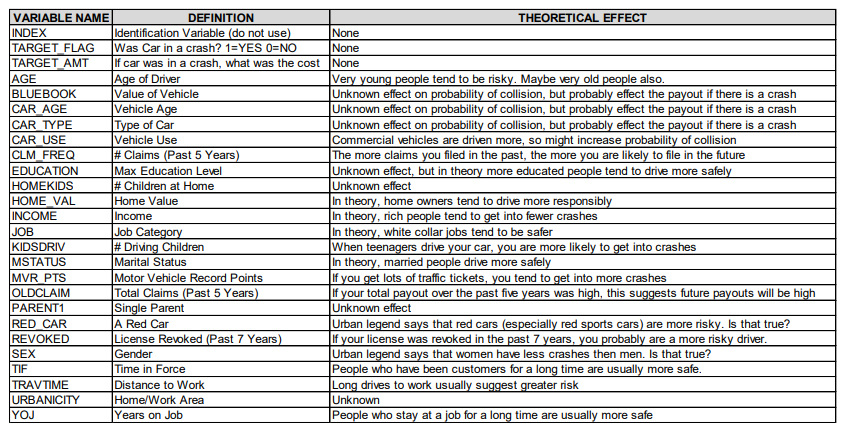

```{r setup, include=FALSE}
knitr::opts_chunk$set(echo = FALSE)
```

## Overview

In this homework assignment, you will explore, analyze and model a data set containing approximately 8000 records representing a customer at an auto insurance company. Each record has two response variables.

The first response variable

TARGET_FLAG, is a 1 or a 0.

-   A "1" means that the person was in a car crash.

-   A "0" means that the person was not in a car crash.

The second response variable is TARGET_AMT.

-   This value is "0" if the person did not crash their car.

-   But if they did crash their car (1), this number will be a value greater than zero (\*) \>0

## Dataset



\newpage

## 1. Data Exploration

```{r packages, echo=FALSE, warning=FALSE, message=FALSE}

library(tidyverse)
library(tidymodels)
library(skimr)
library(tinytex)
library(e1071)
library(ggthemes)
#library(caret)
```

```{r dataset, echo=FALSE, message=FALSE}
df <- read_csv("D:/PORTFOLIO_DS/Portfolio_R/Business_Analytics/Business_Analytics/Projects/PROJECT_HW4/Data/insurance_training_data.csv")

# insu_eval <- read_csv("D:/PORTFOLIO_DS/Portfolio_R/Business_Analytics/Business_Analytics/Projects/PROJECT_HW4/Data/insurance-evaluation-data.csv")
```

### Objective

-   build a multiple linear regression and a binary logistic regression models on the training data
-   predict the probability that a person will crash their car and
-   predict the amount of money it will cost if the person does crash their car

### Data Overview

Lets first look at the raw data values by using the skim package

```{r}

skim_without_charts(df)

```

From the description seen by the skim package we can observe we have two variables that should be transformed into factors since they have (1) or (0) values. `chas & target.`

\newpage

### Cleaning

First we have decided to change the name of certain variables to aid the understanding of their meaning.

```{r}
df1 <- df %>% 
  rename(KIDS = HOMEKIDS,
         TEEN_PERMIT = KIDSDRIV,
         MARRIED = MSTATUS,
         POINTS = MVR_PTS,
         CLAIM_TOT = OLDCLAIM,
         SINGL_PARENT = PARENT1,
         CLIENT_LONG = TIF,
         INJOB = YOJ)
```

**Symbol \$ type char**

We have 4 variables that have the dollar sign in front of them and they are considered character when they should be numeric. We will use str_remove for this process.

| Variables | Removed    | Changed |
|-----------|------------|---------|
| BLUEBOOK  | "\$" , "," | dbl     |
| HOME_VAL  | "\$" , "," | dbl     |
| INCOME    | "\$" , "," | dbl     |
| CLAIM_TOT | "\$" , "," | dbl     |

```{r}

df2 <- df1 %>% 
  mutate(BLUEBOOK = str_remove(BLUEBOOK, "[\\$]"),
         BLUEBOOK = as.numeric(str_remove(BLUEBOOK, "[,]"))) %>% 
  mutate(HOME_VAL = str_remove(HOME_VAL, "[\\$]"),
         HOME_VAL = as.numeric(str_remove(HOME_VAL, "[,]"))) %>%
  mutate(INCOME = str_remove(INCOME, "[\\$]"),
         INCOME = as.numeric(str_remove(INCOME, "[,]"))) %>% 
  mutate(CLAIM_TOT = str_remove(CLAIM_TOT, "[\\$]"),
         CLAIM_TOT = as.numeric(str_remove(CLAIM_TOT, "[,]")))
  
```

**Symbol z\_, \<**

We will proceed to remove symbols found ie. "*z*\_No"

| Variables | Removed                            |
|-----------|------------------------------------|
| Married   | z\_                                |
| Sex       | z\_                                |
| Job       | z\_                                |
| Car_type  | z\_                                |
| Urbancity | z\_, /, Highly Urban, Highly Rural |
| Education | z\_ & \<                           |

```{r}

df3 <- df2 %>% 
  mutate(EDUCATION = str_remove(EDUCATION, "z"),
         EDUCATION = str_remove(EDUCATION, "_"),
         EDUCATION = str_remove(EDUCATION, "<")) %>% 
  mutate(MARRIED = str_remove(MARRIED, "z"),
         MARRIED = str_remove(MARRIED, "_")) %>% 
  mutate(SEX = str_remove(SEX, "z"),
         SEX = str_remove(SEX, "_")) %>% 
  mutate(JOB = str_remove(JOB, "z"),
         JOB = str_remove(JOB, "_")) %>% 
  mutate(CAR_TYPE = str_remove(CAR_TYPE, "z"),
         CAR_TYPE = str_remove(CAR_TYPE, "_")) %>% 
  mutate(URBANICITY = str_remove(URBANICITY, "z"),
         URBANICITY = str_remove(URBANICITY, "_"),
         URBANICITY = str_sub(URBANICITY, 15,19))
         
  
```

**Discrete vs. Continuous**

| Variables     | TYPE   |
|---------------|--------|
| TARGET_FLAG   | factor |
| SINGLE_PARENT | factor |
| MARRIED       | factor |
| SEX           | factor |
| EDUCATION     | factor |
| JOB           | factor |
| CAR_USE       | factor |
| CAR_TYPE      | factor |
| RED_CAR       | factor |
| REVOKED       | factor |
| URBANCITY     | factor |

```{r}
df3F <- df3 %>% 
  mutate( across(where(is_character), as_factor) ) %>% 
  mutate( TARGET_FLAG = factor(TARGET_FLAG) ) %>% 
  select(-INDEX)


```

```{r}
str(df3F)
```

\newpage

### Distributions

We will first explore the data looking for issues or challenges (i.e. missing data, outliers, possible coding errors, multicollinearlity, etc). Once we have a handle on the data, we will apply any necessary cleaning steps. Once we have a reasonable dataset to work with, we will build and evaluate three different Logistic models that predict probabilities and cost.

In this case we will observe the distribution and frequency of numeric variables first.

```{r}

df2_num <- df3F %>% 
  select_if(., is.numeric) 

df3_fct <- df3F %>% 
  select_if(., is.factor)
  
```

```{r}

longnum_df <- df2_num %>% pivot_longer(
    everything(),
    names_to = c("variable"),
    values_to = "value"
  )

longfct_df <- df3_fct %>% pivot_longer(
    everything(),
    names_to = c("variable"),
    values_to = "value")
```

```{r, warning=FALSE}

ggplot(longnum_df, aes(value)) + 
  geom_histogram(aes(x=value, y = ..density..), 
                 colour = 4, bins = 30) +
  geom_density(aes(x=value), color = "red") +
  facet_wrap(~variable, scales = "free")
```

```{r}
ggplot(longfct_df, aes(value)) + 
  stat_count() +
  guides(x = guide_axis(angle = 90)) + 
  facet_wrap(~variable, scales = "free")
```

The distribution of our variables can also alert us of of unusual patterns, in this case we have observed the prevalence of kurtosis for certain variables like:, `BLUEBOOK, CLAIM_TOT`, `INCOME, TRAVTIME` are skewed to the right.

After creating independent histograms for each variable we have found 3 variables that appear to be bi-modal. We notice that the graphs of this variables have two distinct humps or peaks with a valley separating them. We could attribute this observations to possibly different groups. We find that CAR_AGE and CLIENT_LONG, HOME_VAL are bi-modal.

\newpage

### Outliers

In addition to histogram graph of our variable we thought it was pertinent to take a look at our variables using a boxplot. It will help us quickly visualize the distribution of the values in the dataset and see where the five number summary values are located.

In addition, we will be able to create a clear picture of the median values and the spreads across all the distributions. One of the most important observation we will obtain from this graph however, is outlier detection.

Find outliers in red below:

```{r}
ggplot(longnum_df, aes(value, variable)) + 
  geom_boxplot(outlier.color = "red") +
  facet_wrap(~variable, scales = "free", drop = FALSE)+
  coord_flip()
```

Indication of outliers is present in almost all variables except CLM_FREQ

A key is whether an outlier represents a contaminated observation or a rare case.

Are these data points unusual or different in some way from the rest of the data? We will have to consider removing this and refit the data if we consider they could be affecting our results.

One of the first steps in any type of analysis is to take a closer look at the observations that have high leverage since they could have a large impact on the results of a given model.

\newpage

### Relationships

We want use scatter plots in each variable versus the target variable to get an idea of the relationship between them.

The plots indicate interesting relationship between the `target` variable however some of them start showing signs of relationship and groups.

Some of the predictors variables are skewed and not normally distributed, in addition we have outliers and bimodality.

```{r, message=FALSE, warning=FALSE}
num_scatter <- df2_num %>% 
  pivot_longer(
    cols = -TARGET_AMT,
    names_to = c("variable"),
    values_to = "value")
```

```{r, message=FALSE, warning=FALSE}
ggplot(num_scatter, aes(x = value,
                        y = variable,
                        color = TARGET_AMT)) +
  geom_jitter(
    position = position_jitterdodge(dodge.width = 0.8,
                                    jitter.width = 0.3),
    shape=21  )
```

We take some of the variables to be analyzed separately against the target

\newpage

### Skeweness

**Histogram of predictors by factors of target**

```{r, message=FALSE, warning=FALSE}
fct_skew <- df3_fct
  #convert target to factor and new names
  fct_skew$TARGET_FLAG <- recode_factor(fct_skew$TARGET_FLAG,
                                        '0' = 'No Crash',
                                        '1' = 'Crashed' )

```

```{r, message=FALSE, warning=FALSE}
ggplot(fct_skew, aes(x=SINGL_PARENT)) + 
  stat_count(fill = 'white', colour = 'black') + 
  facet_grid(TARGET_FLAG ~ .)
```

```{r, message=FALSE, warning=FALSE}
ggplot(fct_skew, aes(x=MARRIED)) + 
  stat_count(fill = 'white', colour = 'black') + 
  facet_grid(TARGET_FLAG ~ .)
```

```{r, message=FALSE, warning=FALSE}
ggplot(fct_skew, aes(x=SEX)) + 
  stat_count(fill = 'white', colour = 'black') + 
  facet_grid(TARGET_FLAG ~ .)
```

```{r}
ggplot(fct_skew, aes(x=EDUCATION)) + 
  stat_count(fill = 'white', colour = 'black') + 
  facet_grid(TARGET_FLAG ~ .)
```

```{r}
ggplot(fct_skew, aes(x=JOB)) + 
  stat_count(fill = 'white', colour = 'black') + 
  facet_grid(TARGET_FLAG ~ .)
```

```{r}
ggplot(fct_skew, aes(x=CAR_USE)) + 
  stat_count(fill = 'white', colour = 'black') + 
  facet_grid(TARGET_FLAG ~ .)
```

```{r}
ggplot(fct_skew, aes(x=CAR_TYPE)) + 
  stat_count(fill = 'white', colour = 'black') + 
  facet_grid(TARGET_FLAG ~ .)
```

```{r}
ggplot(fct_skew, aes(x=RED_CAR)) + 
  stat_count(fill = 'white', colour = 'black') + 
  facet_grid(TARGET_FLAG ~ .)
```

```{r}
ggplot(fct_skew, aes(x=REVOKED)) + 
  stat_count(fill = 'white', colour = 'black') + 
  facet_grid(TARGET_FLAG ~ .)
```

```{r}
ggplot(fct_skew, aes(x=URBANICITY)) + 
  stat_count(fill = 'white', colour = 'black') + 
  facet_grid(TARGET_FLAG ~ .)
```

We can observe very interesting histograms from the predictors by factors of Target (crashed or not)

| Variable      | Target (crashed or not)                                                                                         |
|---------------|-----------------------------------------------------------------------------------------------------------------|
| SINGLE_PARENT | There are less single parents that have crashed than single parents who have not crashed.                       |
| MARRIED       | There is more Married people who DO NOT crashed rather than Married people who crash                            |
| SEX           | Females are slightly higher on crashed than males. However, the competition is almost equal for no crashes.     |
| EDUCATION     | The Highest rate for crashing is in High school followed by Bachelors degree.                                   |
| JOB           | Blue Collar, clerical and students tend to have the higher rates for crashes.                                   |
| CAR_USE       | Private and Commercial are almost identical. fewer additional cases in Private                                  |
| CAR_TYPE      | The highest rate for crashing is in SUV, Pickup and Minivan. Surprisingly, sport cars are not in the top.       |
| RED_CAR       | It seems like the color of the car has little influence in crashes as there rate of crashes of red cars is low. |
| REVOKED       | People with NO revoked licenses have more crashes than the ones with revoked licences                           |
| URBANICITY    | There is definitively more crashes in Urban areas rather than rural areas.                                      |

\newpage

**Multicolinearity**

**TARGET_AMOUNT**

```{r}
corr_df <- df3 %>%
  mutate( across(where(is_character), as_factor) ) %>%
  select(-INDEX, -TARGET_AMT) %>% 
  select_if(., is.numeric)
```

```{r, warning=FALSE, message=FALSE}

library(corrplot)

corrplot(corr = cor(df2_num, 
                    use = 'pairwise.complete.obs'),
         method = "ellipse",
         type = "upper",
         order = "original",
         tl.col = "black",
         tl.srt = 45,
         tl.cex = 0.55)
```

We can see that some variables are correlated with one another, such as `kids` & `teen_permit`.

When we start considering features for our models, we'll need to account for the correlations between features and avoid including pairs with strong correlations.

Many features are also inherently associated, for example, as the `income` increases to `home_value` increase, In addition, we can see that when `kids` in the household increase age in the policy holder decreases

Both target variables have no direct correlation with any of the predictors.

\newpage

**TARGET_FLAG**

```{r}
corrplot(corr = cor(corr_df, 
                    use = 'pairwise.complete.obs'),
         method = "ellipse",
         type = "upper",
         order = "original",
         tl.col = "black",
         tl.srt = 45,
         tl.cex = 0.55)
```

In this correlation plot we can see more relationships with the target_flag variable.

We can see that as `income` increases the value of `Bluebook` also increases, this is also correlated to the `car_age.` Which makes sense because most people with higher incomes usually drive newer pricier cars.

In addition, we find `Claim_tot` and `Claim_freq` to have a relationship with `Points`.

\newpage

### Correlation

Earlier we discovered the correlation between `AGE` and `KIDS`. We want to understand this relationship better by plotting them.

```{r}
plot((corr_df$AGE),(corr_df$KIDS))
```

```{r, warning=FALSE}
cor.test(corr_df$AGE,corr_df$KIDS, method = "pearson")
```

Regarding the strength of the relationship: The **more extreme** the correlation coefficient (the closer to -1 or 1), the **stronger the relationship**. This also means that a **correlation close to 0** indicates that the two variables are **independent**, that is, as one variable increases, there is no tendency in the other variable to either decrease or increase.

The *p*-value of the correlation test between these 2 variables is 2.2e-16. At the -4.6% significance level, we do not reject the null hypothesis of no correlation. We therefore conclude that we do not reject the hypothesis that there is no linear relationship between the 2 variables.

This test proves that even if the correlation coefficient is different from 0 (the correlation is -0.4 in the sample), it is actually not significantly different from 0 in the population.

\newpage

## 2. Data Preparation

### Missing Data

To prepare our data we have already determined that we have missing data in our dataset.

**Numerical Variables**

We will see our numerical values first:

```{r, message=FALSE, warning=FALSE}
na_df <- corr_df %>% 
  pivot_longer(
    everything(),
    names_to = c("variable"),
    values_to = "value" ) %>% 
  mutate(isna = is.na(value)) %>% 
  group_by(variable) %>% 
  mutate(total = n()) %>% 
  group_by(variable,total,isna) %>% 
  summarise(num.isna = n()) %>% 
  mutate(pct = num.isna / total * 100)
```

```{r}
knitr::kable(na_df)
```

in the case of our numerical variables we will proceed to use a median imputation to complete the data that is missing.

**Factor Variables**

```{r, message=FALSE, warning=FALSE}

na_df2 <- df3_fct %>% 
  pivot_longer(
    everything(),
    names_to = c("variable"),
    values_to = "value" ) %>% 
  mutate(isna = is.na(value)) %>% 
  group_by(variable) %>% 
  mutate(total = n()) %>% 
  group_by(variable,total,isna) %>% 
  summarise(num.isna = n()) %>% 
  mutate(pct = num.isna / total * 100)
```

```{r}
knitr::kable(na_df2)
```

| Variable | Median Imputation |
|----------|-------------------|
| AGE      | TRUE              |
| CAR_AGE  | TRUE              |
| HOME_VAL | TRUE              |
| INCOME   | TRUE              |
| INJOB    | TRUE              |

\newpage

### Correlation

In order to determine the best predictor for our model we need to detect which are the predictor variables with low correlation value. We use the corrr package to determine all the variables with values \<0.10. This will allow us to only manipulate the variables that have significance to our model.

**TARGET_AMT**

```{r, warning=FALSE, message=FALSE}

library(corrr)
corr_tgamt <- correlate(df2_num,use = "pairwise.complete.obs",
          method = "spearman")
  
```

```{r}
corr_tgamt %>% 
  focus(TARGET_AMT) %>% 
  fashion()
```

TARGET_FLAG

```{r, warning=FALSE}
corr_tgflag <- correlate(corr_df,use = "pairwise.complete.obs",
          method = "spearman")
```

```{r}
corr_tgflag %>% 
  focus(TARGET_FLAG) %>% 
  fashion()
```

\newpage

### Preprocess

**Recommended pre processing outline**

While every individual project's needs are different, here is a suggested order of *potential* steps that should work for most problems:

1.  Impute

2.  Handle factor levels

3.  Individual transformations for skewness and other issues

4.  Discretize (if needed and if you have no other choice)

5.  Create dummy variables

6.  Create interactions

7.  Normalization steps (center, scale, range, etc)

8.  Multivariate transformation (e.g. PCA, spatial sign, etc)

Lets take a look at our dataset now.

```{r, echo=FALSE}
df3F %>% 
  group_by(TARGET_FLAG) %>% 
  summarise(count = n() ) %>% 
  mutate( prop = count / sum(count) )
```

| Was car in a crash? | Target var codes | Percent Frequency |
|---------------------|:----------------:|:-----------------:|
| Yes                 |        1         |        26%        |
| No                  |        0         |        74%        |

We can see that the only variable with missing values is JOBS. The percentage of missing values in JOBS is 6.44%. When we build our recipe we will take care of this factor variable.

```{r}
# plot dist of jobs

ggplot(df3F, aes(x = JOB)) + 
  geom_bar(fill = "cornflowerblue",
           color = "black") + 
  labs(x = "Job Categories",
       y = "Frequency")
```

\newpage

**Partition**

The tidymodels `rsample` library handles data splitting. Training and testing split is done as shown,.

To get started, let's split this single dataset into two: a *training* set and a *testing* set. We'll keep most of the rows in the original dataset (subset chosen randomly) in the *training* set. The training data will be used to *fit* the model, and the *testing* set will be used to measure model performance.

To do this, we can use the [`rsample`](https://rsample.tidymodels.org/) package to create an object that contains the information on *how* to split the data, and then two more rsample functions to create data frames for the training and testing sets:

```{r, warning=FALSE}

library(tidymodels)

set.seed(1188)
data_split <- initial_split(df3F, prop = 3/4)

train_data <- training(data_split)
test_data <- testing(data_split)

cv_folds <-
  vfold_cv(train_data,
           v = 5,
           strata = TARGET_FLAG)

```

Remember that we already partitioned our data set into a *training set* and *test set*. This lets us judge whether a given model will generalize well to new data. However, using only two partitions may be insufficient when doing many rounds of hyperparameter tuning (which we don't perform in this tutorial but it is always recommended to use a validation set).

Therefore, it is usually a good idea to create a so called `validation set`. Watch this short [video from Google's Machine Learning crash course](https://developers.google.com/machine-learning/crash-course/validation/video-lecture) to learn more about the value of a validation set.

We use k-fold crossvalidation to build a set of 5 validation folds with the function `vfold_cv`. We also use stratified sampling.

We will come back to the *validation set* after we specified our models.

\newpage

**Recipes & Roles**

The recipes package is our go-to for defining the steps that will be used to pre-process the data. We will see examples for imputing missing data, one hot encoding the dummy variables (transforming the variables to where each level has a column), removing near zero variance predictors, and normalizing the predictors.

To get started, let's create a recipe for a simple **logistic regression** model. Before training the model, we can use a recipe to create a few new predictors and conduct some preprocessing required by the model.

The type of data preprocessing is dependent on the data and the type of model being fit. The excellent book "Tidy Modeling with R" provides an [appendix with recommendations for baseline levels of preprocessing](https://www.tmwr.org/pre-proc-table.html) that are needed for various model functions.

Let's create a base `recipe` for all of our classification models. Note that the sequence of steps matter:

-   The `recipe()` function has two arguments:

    1.  A formula. Any variable on the left-hand side of the tilde (`~`) is considered the model outcome (here, `price_category`). On the right-hand side of the tilde are the predictors. Variables may be listed by name (separated by a `+`), or you can use the dot (`.`) to indicate all other variables as predictors.

    2.  The data. A recipe is associated with the data set used to create the model. This will typically be the training set, so `data = train_data` here.

Let's initiate a new recipe:

#### **Recipe 1**

Recipe 1 includes BOXCOX transformations

```{r rec1}

auto_recipe <-
  recipe(TARGET_FLAG ~ ., data = train_data) %>% 
  update_role(TARGET_AMT, new_role = "ID") %>% 
  step_impute_median(AGE, CAR_AGE, HOME_VAL, INCOME, INJOB) %>% 
  step_impute_mode(JOB) %>%  
  step_BoxCox(all_numeric_predictors()) %>% 
  step_novel(all_nominal_predictors(), -all_outcomes()) %>% 
  step_dummy(all_nominal_predictors(), -all_outcomes()) %>% 
  step_zv(all_numeric_predictors(), -all_outcomes()) %>% 
  step_corr(all_predictors(), threshold = 0.7, method = "spearman") %>% 
  step_normalize(all_numeric_predictors())
  
  

```

```{r}
summary(auto_recipe)
```

```{r, message=FALSE, warning=FALSE}
prepped_data<-
  auto_recipe %>% 
  prep() %>% 
  juice()
```

```{r}
glimpse(prepped_data)
```

#### **Recipe 2**

For this classification model we will change the recipe removing BOXCOX and correlation variables

```{r rec2, warning=FALSE, message=FALSE}
auto_recipe2 <-
  recipe(TARGET_FLAG ~ ., data = train_data) %>% 
  update_role(TARGET_AMT, new_role = "ID") %>% 
  step_impute_median(AGE, CAR_AGE, HOME_VAL, INCOME, INJOB) %>% 
  step_impute_mode(JOB) %>%  
  step_novel(all_nominal_predictors(), -all_outcomes()) %>% 
  step_dummy(all_nominal_predictors(), -all_outcomes()) %>% 
  step_zv(all_numeric_predictors(), -all_outcomes()) %>% 
  step_normalize(all_numeric_predictors())
```

```{r}
summary(auto_recipe2)
```

```{r, warning=FALSE}
prepped_data2<-
  auto_recipe2 %>% 
  prep() %>% 
  juice()
```

```{r}
glimpse(prepped_data2)
```

#### **Recipe 3**

For this Multiple Linear regression model we will change the recipe removing TARGET_FLAG for TARGET_AMT

```{r}
auto_recipe3 <-
  recipe(TARGET_AMT ~ ., data = train_data) %>% 
  update_role(TARGET_FLAG, new_role = "ID") %>% 
  step_impute_median(AGE, CAR_AGE, HOME_VAL, INCOME, INJOB, TRAVTIME,
                     CLAIM_TOT) %>% 
  step_impute_mode(JOB) %>%  
  step_novel(all_nominal_predictors(), -all_outcomes()) %>% 
  step_dummy(all_nominal_predictors(), -all_outcomes()) %>% 
  step_zv(all_numeric_predictors(), -all_outcomes()) %>% 
  step_normalize(all_numeric_predictors())
```

```{r}
prepped_data3<-
  auto_recipe3 %>% 
  prep() %>% 
  juice()
```

```{r}
glimpse(prepped_data3)
```

\newpage

## 3. Building Models

### Logistic Regression

Next, we specify our linear regression model with `parsnip`.

```{r cls}
logreg_model <- logistic_reg() %>% 
                set_engine('glm') %>% 
                set_mode("classification")

logreg_model
```

### Random Forest

For this classification model we will change the recipe including log numerical data, removing high correlation variables and removing any numeric variables that have zero variance.

```{r fr, warning=FALSE}
library(ranger)

rf_model <-
  rand_forest() %>% 
  set_engine("ranger", importance = "impurity") %>% 
  set_mode("classification")

rf_model
```

### Boosted Tree

```{r xgb, warning=FALSE}

library(xgboost)

xgb_model <-
  boost_tree() %>% 
  set_engine("xgboost") %>% 
  set_mode("classification")

xgb_model
```

### LM LINEAR Regression

Next, we specify our linear regression model with `parsnip`.

```{r}
lm_model <- # your model specification
  linear_reg() %>%  # model type
  set_engine(engine = "lm") %>%  # model engine
  set_mode("regression") # model mode

# Show your model specification
lm_model
```

### GLM LINEAR Regression

```{r}
glm_model <-
  linear_reg() %>% 
  set_engine(engine = "glm") %>% 
  set_mode("regression")

glm_model
```

\newpage

## **3.2 Workflow Creation**

To combine the data preparation recipe with the model building, we use the package [workflows](https://workflows.tidymodels.org/). A workflow is an object that can bundle together your pre-processing recipe, modeling, and even post-processing requests (like calculating the RMSE).

### Logistic Regression

```{r}
log_wflow <-  
  workflow() %>%
  add_model(logreg_model) %>% 
  add_recipe(auto_recipe)

log_wflow
              
```

### Random Forest

```{r}

rf_wflow <-
 workflow() %>%
 add_recipe(auto_recipe2) %>% 
 add_model(rf_model) 

rf_wflow
```

### Boosted Tree

```{r}

xgb_wflow <-
 workflow() %>%
 add_recipe(auto_recipe) %>% 
 add_model(xgb_model)

xgb_wflow
```

### LM LINEAR Regression

```{r}
lm_wflow <-
 workflow() %>%
 add_recipe(auto_recipe3) %>% 
 add_model(lm_model)

lm_wflow
```

### GLM LINEAR Regression

```{r}

glm_wflow <-
 workflow() %>%
 add_recipe(auto_recipe3) %>% 
 add_model(glm_model)

glm_wflow
```

### 

\newpage

## 4. Evaluate Models

Now we can use our validation set (`cv_folds`) to estimate the performance of our models using the `fit_resamples()` function to fit the models on each of the folds and store the results.

Note that `fit_resamples()` will fit our model to each resample and evaluate on the heldout set from each resample. The function is usually only used for computing performance metrics across some set of resamples to evaluate our models (like accuracy) - the models are not even stored. However, in our example we save the predictions in order to visualize the model fit and residuals with `control_resamples(save_pred = TRUE)`.

Finally, we collect the performance metrics with `collect_metrics()` and pick the model that does best on the validation set.

### Logistic Regression

We use our workflow object to perform resampling. Furthermore, we use `metric_set()`to choose some common classification performance metrics provided by the `yardstick` package. Visit [`yardsticks` reference](https://yardstick.tidymodels.org/reference/index.html) to see the complete list of all possible metrics.

```{r, warning=FALSE, message=FALSE}

log_res <- 
  log_wflow %>% 
  fit_resamples(
    resamples = cv_folds, 
    metrics = metric_set(
      recall, precision, f_meas, 
      accuracy, kap,
      roc_auc, sens, spec),
    control = control_resamples(
      save_pred = TRUE)
    ) 
```

Show average performance over all folds

```{r}
log_res %>% collect_metrics(summarize = T)
```

Show performance for every single fold:

```{r}
log_res %>% collect_metrics(summarize = F)
```

**Collect Predictions**

To obtain the actual model predictions, we use the function `collect_predictions` and save the result as `log_pred`:

```{r}
log_pred <-
  log_res %>% 
  collect_predictions()
```

**Confusion Matrix**

Now we can use the predictions to create a *confusion matrix* with `conf_mat()`:

```{r}
log_pred %>% 
  conf_mat(TARGET_FLAG, .pred_class)
```

```{r}
log_pred %>% 
  conf_mat(TARGET_FLAG, .pred_class) %>% 
  autoplot(type = "heatmap")
```

**ROC-Curve**

We can also make an ROC curve for our 5 folds. Since the category we are predicting is the second level in the TARGET_FLAG factor ("1"), we provide `roc_curve()` with the relevant class probability `.pred_1`:

```{r}

log_pred %>% 
  group_by(id) %>% # id contains our folds
  roc_curve(TARGET_FLAG, .pred_1) %>% 
  autoplot()

```

**Probability Distributions**

```{r}
log_pred %>% 
  ggplot() +
  geom_density(aes(x = .pred_1, 
                   fill = TARGET_FLAG), 
               alpha = 0.5)
```

\newpage

### Random Forests

We don't repeat all of the steps shown in logistic regression and just focus on the performance metrics

```{r}

rf_res <-
  rf_wflow %>% 
  fit_resamples(
    resamples = cv_folds, 
    metrics = metric_set(
      recall, precision, f_meas, 
      accuracy, kap,
      roc_auc, sens, spec),
    control = control_resamples(save_pred = TRUE)
    ) 

rf_res %>%  collect_metrics(summarize = TRUE)
```

### Xboost

```{r}

xgb_res <- 
  xgb_wflow %>% 
  fit_resamples(
    resamples = cv_folds, 
    metrics = metric_set(
      recall, precision, f_meas, 
      accuracy, kap,
      roc_auc, sens, spec),
    control = control_resamples(save_pred = TRUE)
    ) 

xgb_res %>% collect_metrics(summarize = TRUE)
```

\newpage

### LINEAR REGRESSION

First we build a validation set with K-fold crossvalidation for linear regression:

```{r}
cv_folds2 <-
  vfold_cv(train_data,
           v = 5,
           strata = TARGET_AMT,
           breaks = 5)

cv_folds2
```

### LM LINEAR REGRESSION

```{r}
lm_wflow_eval <- 
  lm_wflow %>% 
  fit_resamples(
    TARGET_AMT ~ ., 
    resamples = cv_folds
    ) 

lm_wflow_eval%>% 
    collect_metrics()
```

### GLM LINEAR REGRESSION

```{r}
glm_wflow_eval <- 
  glm_wflow %>% 
  fit_resamples(
    TARGET_AMT ~ ., 
    resamples = cv_folds
    ) 

glm_wflow_eval%>% 
    collect_metrics()
```

\newpage

## Final Selection

The predictions show that there are still underlying problems with hte models that need to be resolved. All 3 models produced predictions that are not on par with the distributions in the original training dataset indicating that they are not a good fit for the data. This is evidenced inthe histogrema below as well as in the summary statistics above.

```{r}
log_metrics <- 
  log_res %>% 
  collect_metrics(summarise = TRUE) %>%
  mutate(model = "Logistic Regression") # add the name of the model to every row

rf_metrics <- 
  rf_res %>% 
  collect_metrics(summarise = TRUE) %>%
  mutate(model = "Random Forest")

xgb_metrics <- 
  xgb_res %>% 
  collect_metrics(summarise = TRUE) %>%
  mutate(model = "XGBoost")

# create dataframe with all models
model_compare <- bind_rows(
                          log_metrics,
                           rf_metrics,
                           xgb_metrics
                           ) 

```

```{r}
# change data structure
model_comp <- 
  model_compare %>% 
  select(model, .metric, mean, std_err) %>% 
  pivot_wider(names_from = .metric, values_from = c(mean, std_err)) 

```

```{r}
# show mean F1-Score for every model
model_comp %>% 
  arrange(mean_f_meas) %>% 
  mutate(model = fct_reorder(model, mean_f_meas)) %>% # order results
  ggplot(aes(model, mean_f_meas, fill=model)) +
  geom_col() +
  coord_flip() +
  scale_fill_brewer(palette = "Blues") +
   geom_text(
     size = 3,
     aes(label = round(mean_f_meas, 2), y = mean_f_meas + 0.08),
     vjust = 1
  )
```

```{r}
# show mean area under the curve (auc) per model
model_comp %>% 
  arrange(mean_roc_auc) %>% 
  mutate(model = fct_reorder(model, mean_roc_auc)) %>%
  ggplot(aes(model, mean_roc_auc, fill=model)) +
  geom_col() +
  coord_flip() +
  scale_fill_brewer(palette = "Blues") + 
     geom_text(
     size = 3,
     aes(label = round(mean_roc_auc, 2), y = mean_roc_auc + 0.08),
     vjust = 1
  )
```

Note that the model results are all quite similar. In our example we choose the F1-Score as performance measure to select the best model. Let's find the maximum mean F1-Score:

```{r}
model_comp %>% slice_max(mean_f_meas)
```

## References

[Ordering of steps • recipes (tidymodels.org)](https://recipes.tidymodels.org/articles/Ordering.html)

[Linear regression --- linear_reg • parsnip (tidymodels.org)](https://parsnip.tidymodels.org/reference/linear_reg.html)

[Linear regression via lm --- details_linear_reg_lm • parsnip (tidymodels.org)](https://parsnip.tidymodels.org/reference/details_linear_reg_lm.html)

[(5) Evaluating ML Performance, Resampling, and Workflows in "tidymodels" \| R Tutorial (2021) - YouTube](https://www.youtube.com/watch?v=sjatHUL66sA)

## Apendix

```{r, ref.label=knitr::all_labels(), echo=TRUE, eval=FALSE}

```
