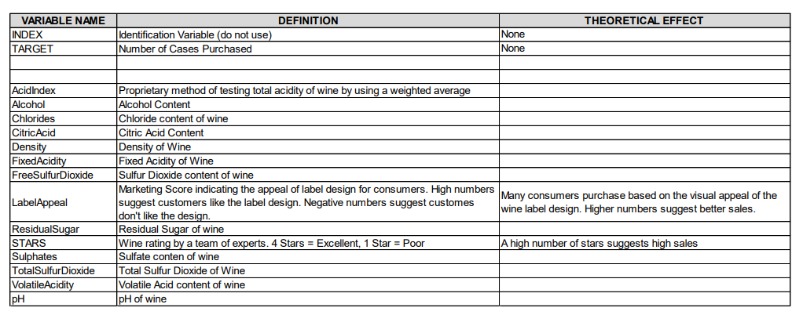
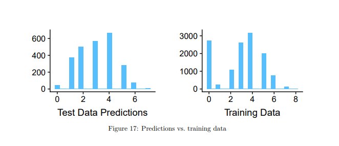

```{r setup, include=FALSE}
knitr::opts_chunk$set(echo = FALSE)
```

## Overview

In this homework assignment, you will explore, analyze and model a data set containing information on approximately 12,000 commercially available wines.

The variables are mostly related to the chemical properties of the wine being sold. The response variable is the number of sample cases of wine that were purchased by wine distribution companies after sampling a wine.

These cases would be used to provide tasting samples to restaurants and wine stores around the United States. The more sample cases purchased, the more likely is a wine to be sold at a high end restaurant.

A large wine manufacturer is studying the data in order to predict the number of wine cases ordered based upon the wine characteristics. If the wine manufacturer can predict the number of cases, then that manufacturer will be able to adjust their wine offering to maximize sales

## Dataset



\newpage

## 1. Data Exploration

```{r packages, echo=FALSE, warning=FALSE, message=FALSE}

library(tidyverse)
library(skimr)
library(tinytex)
library(e1071)
library(ggthemes)
library(caret)
```

```{r dataset, echo=FALSE, message=FALSE}
wine_train <- read_csv("D:/PORTFOLIO_DS/Portfolio_R/Business_Analytics/Business_Analytics/Projects/PROJECT_HW5/Data/wine-training-data.csv")

# wine_eval <- read_csv("https://raw.githubusercontent.com/mgino11/Business_Analytics/main/Projects/PROJECT_HW3/crime-evaluation-data_modified.csv")
```

### Objective

-   Build a count regression model

-   Predict the number of cases of wine that will be sold. (properties)

### Data Overview

Lets first look at the raw data values by using the skim package

```{r}

skim_without_charts(wine_train)

```

From the description seen by the skim package we can observe all of our variables are type numeric. There are some variables like `ResidualSugar, Chlorides, FreeSulfurDioxide, TotalSulfurDioxide, Sulphates, Alcohol` that have missing values.

\newpage

### Distributions

We will first explore the data looking for issues or challenges (i.e. missing data, outliers, possible coding errors, multicollinearlity, etc). Once we have a handle on the data, we will apply any necessary cleaning steps. Once we have a reasonable dataset to work with, we will build and evaluate three different Logistic models that predict seasonal wins.

```{r}

wine_dist <- wine_train %>% 
  select(-INDEX) %>% 
  pivot_longer(
    everything(),
    names_to = c("variable"),
    values_to = "value"
  )
```

```{r, warning=FALSE, message=FALSE}

ggplot(wine_dist, aes(value)) + 
  geom_histogram(aes(x=value, y = ..density..), 
                 colour = 4, bins = 30) +
  geom_density(aes(x=value), color = "red") +
  facet_wrap(~variable, scales = "free")

ggsave("wine_dist.pdf")

```

The distribution of our variables can also alert us of of unusual patterns, in this case we have observed most of our variables appear to have normal distributions. We will explore with more detail each variable to understand their individual behavior.

After creating independent histograms for each variable we have found 3 variables that appear to be bi-modal. We notice that the graphs of this variables have two or more distinct humps or peaks with a valley separating them. We could attribute this observations to possibly different groups. We find that `AcidIndex`, `LabelAppeal` and `STARS` and `Target` are bi-modal.

\newpage

### Outliers

In addition to histogram graph of our variable we thought it was pertinent to take a look at our variables using a boxplot. It will help us quickly visualize the distribution of the values in the dataset and see where the five number summary values are located.

In addition, we will be able to create a clear picture of the median values and the spreads across all the distributions. One of the most important observation we will obtain from this graph however, is outlier detection.

Find outliers in red below:

```{r}
ggplot(wine_dist, aes(value, variable)) + 
  geom_boxplot(outlier.color = "red") +
  facet_wrap(~variable, scales = "free", drop = FALSE)+
  coord_flip()
```

Indication of outliers is present in variables almost all variables.

A key is whether an outlier represents a contaminated observation or a rare case.

Are these data points unusual or different in some way from the rest of the data? We will have to consider removing this and refit the data if we consider they could be affecting our results.

One of the first steps in any type of analysis is to take a closer look at the observations that have high leverage since they could have a large impact on the results of a given model.

\newpage

### Relationships

We want use scatter plots in each variable versus the target variable to get an idea of the relationship between them.

The plots indicate interesting relationship between the `target` variable however some of them start showing signs of relationship and groups.

Some of the predictors variables are skewed and not normally distributed, in addition we have outliers and bimodality.

```{r, message=FALSE, warning=FALSE}
wine_scatter <- wine_train %>% 
  select(-INDEX) %>% 
  pivot_longer(
    cols = -TARGET,
    names_to = c("variable"),
    values_to = "value")
```

```{r, message=FALSE, warning=FALSE}
ggplot(wine_scatter, aes(x = value, 
                          y = variable, 
                          color = as_factor(TARGET))) +
  geom_jitter(position = position_jitterdodge(dodge.width = 0.8,
                                              jitter.width = 0.3),
             shape=21  )
```

We take some of the variables to be analyzed separately against the target

\newpage

### Skeweness

**Histogram of predictors by factors of target**

```{r, message=FALSE, warning=FALSE}
wine_skew <- wine_train %>% 
  select(-INDEX)
  #convert target to factor and new names
  # wine_skew$TARGET <- recode_factor(
  #   wine_skew$TARGET, '0' = '','1' = 'high crime' )

```

```{r, message=FALSE, warning=FALSE}
ggplot(wine_skew, aes(x=AcidIndex)) + 
  geom_histogram(fill = 'white', colour = 'black') + 
  facet_grid(TARGET ~ .)
```

```{r, message=FALSE, warning=FALSE}
ggplot(wine_skew, aes(x=Alcohol)) + 
  geom_histogram(fill = 'white', colour = 'black') + 
  facet_grid(TARGET ~ .)
```

```{r, message=FALSE, warning=FALSE}
ggplot(wine_skew, aes(x=Chlorides)) + 
  geom_histogram(fill = 'white', colour = 'black') + 
  facet_grid(TARGET ~ .)
```

```{r, message=FALSE, warning=FALSE}
ggplot(wine_skew, aes(x=CitricAcid)) + 
  geom_histogram(fill = 'white', colour = 'black') + 
  facet_grid(TARGET ~ .)

```

```{r, message=FALSE, warning=FALSE}
ggplot(wine_skew, aes(x=Density)) + 
  geom_histogram(fill = 'white', colour = 'black') + 
  facet_grid(TARGET ~ .)

```

```{r, message=FALSE, warning=FALSE}
ggplot(wine_skew, aes(x=FixedAcidity)) + 
  geom_histogram(fill = 'white', colour = 'black') + 
  facet_grid(TARGET ~ .)

```

```{r, message=FALSE, warning=FALSE}
ggplot(wine_skew, aes(x=FreeSulfurDioxide)) + 
  geom_histogram(fill = 'white', colour = 'black') + 
  facet_grid(TARGET ~ .)

```

```{r, message=FALSE, warning=FALSE}
ggplot(wine_skew, aes(x=LabelAppeal)) + 
  geom_histogram(fill = 'white', colour = 'black') + 
  facet_grid(TARGET ~ .)
```

```{r message=FALSE, warning=FALSE}
ggplot(wine_skew, aes(x=pH)) + 
  geom_histogram(fill = 'white', colour = 'black') + 
  facet_grid(TARGET ~ .)

```

```{r, message=FALSE, warning=FALSE}
ggplot(wine_skew, aes(x=ResidualSugar)) + 
  geom_histogram(fill = 'white', colour = 'black') + 
  facet_grid(TARGET ~ .)

```

```{r, message=FALSE, warning=FALSE}
ggplot(wine_skew, aes(x=STARS)) + 
  geom_histogram(fill = 'white', colour = 'black') + 
  facet_grid(TARGET ~ .)

```

```{r, message=FALSE, warning=FALSE}
ggplot(wine_skew, aes(x=Sulphates)) + 
  geom_histogram(fill = 'white', colour = 'black') + 
  facet_grid(TARGET ~ .)

```

```{r, message=FALSE, warning=FALSE}
ggplot(wine_skew, aes(x=TotalSulfurDioxide)) + 
  geom_histogram(fill = 'white', colour = 'black') + 
  facet_grid(TARGET ~ .)

```

```{r, message=FALSE, warning=FALSE}
ggplot(wine_skew, aes(x=VolatileAcidity)) + 
  geom_histogram(fill = 'white', colour = 'black') + 
  facet_grid(TARGET ~ .)

```

| Variable              | Target : Number of cases purchased |
|-----------------------|------------------------------------|
| Acid Index            |                                    |
| Alcohol               |                                    |
| Chlorides             |                                    |
| Citric Acid           |                                    |
| Density               |                                    |
| Fixed Acidity         |                                    |
| Free Sulfur Dioxide   |                                    |
| Label Appeal          |                                    |
| Residual Sugar        |                                    |
| STARS                 |                                    |
| Sulphites             |                                    |
| Total Sulphur Dioxide |                                    |
| Volatile Acidy        |                                    |
| pH                    |                                    |
|                       |                                    |

\newpage

**Multicolinearity**

```{r, warning=FALSE, message=FALSE}

library(corrplot)

corrplot(corr = cor(wine_train, 
                    use = 'pairwise.complete.obs'),
         method = "ellipse",
         type = "upper",
         order = "original",
         tl.col = "black",
         tl.srt = 45,
         tl.cex = 0.55)
```

We can observe that there are some variables that have correlation between each other.

`LabelAppeal` and `STARTS` seem to have positive correlation. In addition, we can observe that `LabelAppeal` also has positive correlation with Alcohol.

There is slight negative correlation between `AcidIndex, STARS, TARGET`.

\newpage

### Correlation

Earlier we discovered the correlation between `LabelAppea`l and `STARS`. We want to understand this relationship better by plotting them.

```{r}
plot((wine_train$LabelAppeal),(wine_train$STARS))
```

The plot of correlation between rad and tax shoes 90% of the relationship is made by the influential points. This predictors are not really correlated.

```{r, warning=FALSE}
cor.test(wine_train$LabelAppeal, wine_train$STARS, method = "pearson")
```

Regarding the strength of the relationship: The **more extreme** the correlation coefficient (the closer to -1 or 1), the **stronger the relationship**. This also means that a **correlation close to 0** indicates that the two variables are **independent**, that is, as one variable increases, there is no tendency in the other variable to either decrease or increase.

The *p*-value of the correlation test between these 2 variables is 2.2e-16. At the 3% significance level, we do not reject the null hypothesis of no correlation. We therefore conclude that we do not reject the hypothesis that there is no linear relationship between the 2 variables.

This test proves that even if the correlation coefficient is different from 0 (the correlation is 0.3 in the sample), it is actually not significantly different from 0 in the population.

The larger the sample size and the more extreme the correlation (closer to -1 or 1), the more likely the null hypothesis of no correlation will be rejected. With a small sample size, it is thus possible to obtain a *relatively* large correlation in the sample (based on the correlation coefficient), but still find a correlation not significantly different from 0 in the population (based on the correlation test). For this reason, it is recommended to always perform a correlation test before interpreting a correlation coefficient to avoid flawed conclusions.

\newpage

## 2. Data Preparation

### Missing Data

To prepare our data we have determined that there is some data that has missing values.

See below:

```{r, message=FALSE, warning=FALSE}
wine_na <- wine_train %>%
  select(-INDEX) %>% 
  pivot_longer(
    everything(),
    names_to = c("variable"),
    values_to = "value" ) %>% 
  mutate(isna = is.na(value)) %>% 
  group_by(variable) %>% 
  mutate(total = n()) %>% 
  group_by(variable,total,isna) %>% 
  summarise(num.isna = n()) %>% 
  mutate(pct = num.isna / total * 100)
```

```{r}
knitr::kable(wine_na)
```

\newpage

### Correlation

In order to determine the best predictor for our model we need to detect which are the predictor variables with low correlation value. We use the corrr package to determine all the variables with values \<0.10. This will allow us to only manipulate the variables that have significance to our model.

```{r, warning=FALSE, message=FALSE}

library(corrr)
wine_corr <- correlate(wine_train,
                        use = "pairwise.complete.obs",
                        method = "spearman")
  
  
```

```{r}
wine_corr %>% 
  select(-INDEX) %>% 
  focus(TARGET) %>% 
  fashion()
```

\newpage

### Preprocess

```{r, echo=FALSE}
wine_train %>% 
  group_by(TARGET) %>% 
  summarise(count = n() ) %>% 
  mutate( prop = count / sum(count) )
```

| Number of Cases Purchased | Target var codes | Percent Frequency |
|---------------------------|:----------------:|:-----------------:|
| 0                         |        0         |        21%        |
| 1                         |        1         |        2%         |
| 2                         |        2         |        9%         |
| 3                         |        3         |        20%        |
| 4                         |        4         |        25%        |
| 5                         |        5         |        16%        |
| 6                         |        6         |        6%         |
| 7                         |        7         |        1%         |
| 8                         |        8         |       0.1%        |

### **Partition**

The first thing we will do is to divide our training data into two parts: train set and test set. Our partition will be 70%, 30%

Caret provides us the `CreateDataPartition()` function for this, which will allow us to partition based on the proportion from the response variable.

```{r}
df <- wine_train %>% 
  select(-INDEX)
```

```{r}
set.seed(1188)
trainIndex <- createDataPartition(df$TARGET, p = 0.7, list = F)
trainSet <- df[trainIndex,]
testSet <- df[-trainIndex,]
```

```{r}
skim_without_charts(trainSet)
```

\newpage

### Imputation

We've seen that the dataset has few missing values across all columns, we may to do well to impute it.

A popular algorithm to do imputation is the k-Nearest Neighbors. This can be quickly and easily be done using caret. Because, caret offers a nice convenient `preProcess` function that can predict missing values besides other preprocessing. To predict the missing values with k-Nearest Neighbors using `preProcess()`:

```{r}
preProcess_na_model <- preProcess(trainSet[,-1], method='bagImpute')
preProcess_na_model
```

```{r}

trainSet <- predict(preProcess_na_model, newdata = trainSet)
```

```{r}
skim_without_charts(trainSet)
```

\newpage

### **Normalization**

Typically we **normalize** data when performing some type of analysis in which we have multiple variables that are measured on different scales and we want each of the variables to have the same range.

```{r}
yeoJohnsonModel <- preProcess(trainSet[,2:14], method = "YeoJohnson")
trainSet <- predict(yeoJohnsonModel, newdata = trainSet)
```

```{r}
skim_without_charts(trainSet)
```

\newpage

### Features

**Importance of Features**

Now that the preprocessing is complete, let's visually examine how the predictors influence the Y (Target - Number of Cases Purchased). In this problem, the X variables are numeric whereas the Y is categorical. So how to gauge if a given X is an important predictor of Y? A simple common sense approach is, if you group the X variable by the categories of Y, a significant mean shift among the X's groups is a strong indicator (if not the only indicator) that X will have a significant role to help predict Y. It is possible to watch this shift visually using box plots and density plots. In fact, caret's `featurePlot()` function makes it so convenient. Simply set the X and Y parameters and set `plot='box'`. You can additionally adjust the label font size (using `strip`) and the scales to be free as I have done in the below plot.

```{r, warning=FALSE}

featurePlot(x = trainSet[, 2:7],
            y = as.factor(trainSet$TARGET),
            plot = "box",
            ## Pass in options to bwplot() 
            scales = list(y = list(relation="free"),
                          x = list(rot = 90)),  
            auto.key = list(columns = 2))
```

```{r}
featurePlot(x = trainSet[, 8:15],
            y = as.factor(trainSet$TARGET),
            plot = "box",
            ## Pass in options to bwplot() 
            scales = list(y = list(relation="free"),
                          x = list(rot = 90)),  
            auto.key = list(columns = 2))
```

Let me quickly refresh how to interpret a boxplot. Each subplot in the above figure has eight (8) boxplots (in blue) inside it, one each for each of the Y categories, 1-8 purchased boxex. The top of the box represents the 25th %ile and the bottom of the box represents the 75th %ile.

The black dot inside the box is the mean. The blue box represents the region where most of the regular data point lie. The subplots also show many blue dots lying outside the top and bottom dashed lines called whiskers. These dots are formally considered as extreme values. What other predictors do you notice have significant mean differences?`LabelAppleal` is the only one with significant mean differences.

\newpage

## 3. Building Models

-   Dependent Variable: Whether or not the crime rate is above median crime rate

-   Independent variables: all predictors described earlier.

### Poisson 1

We will begin our first model using all the predictors without being transformed to see the level of significance of each one of them. This model will include all original values without any transformation.

**Poisson with Raw Data**

```{r poissonraw}
poisson_model <- glm(TARGET ~ .,
                     family = "poisson",
                     data = df)
```

```{r}
summary(poisson_model)

```

-   The deviance can be used as a goodness-of-fit.

-   We test H0: ' the model is appropiate' vs. h1: The model is not appropiate'

**p-value of Residual Deviance goodness-of-fit test**

```{r}
1-pchisq(deviance(poisson_model), df = poisson_model$df.residual)
```

**Pearson Goodness-of-fit**

```{r, warning=FALSE}
Pearson_raw <- sum((df$TARGET - poisson_model$fitted.values)^2
                   / poisson_model$fitted.values)

1 - pchisq(Pearson_raw, df = poisson_model$df.residual)
```

\newpage

### Poisson 2

**Poisson with Transformed Data**

```{r poisson, warning=FALSE, message=FALSE}
poisson_trans <- glm(TARGET ~ .,
                     family = "poisson",
                     data = trainSet)
```

```{r}
summary(poisson_trans)
```

-   The deviance can be used as a goodness-of-fit.

-   We test H0: ' the model is appropiate' vs. h1: The model is not appropiate'

**p-value of Residual Deviance goodness-of-fit test**

```{r}
1-pchisq(deviance(poisson_trans), df = poisson_trans$df.residual)
```

```{r}
Pearson_trans <- sum((trainSet$TARGET - poisson_trans$fitted.values)^2
                   / poisson_trans$fitted.values)

1 - pchisq(Pearson_trans, df = poisson_trans$df.residual)
```

**Mean = Variance Assumption**

```{r}
lambdahat <- fitted(poisson_trans)
par(mfrow=c(1,2), pty="s")

plot(lambdahat, (trainSet$TARGET-lambdahat)^2,
      xlab=expression(hat(lambda)), ylab=expression((y-hat(lambda))^2 ))

plot(lambdahat, resid(poisson_trans, type = "pearson"),
     xlab=expression(hat(lambda)), ylab="Pearson_Residuals")
```

From the first graph we can see that the range of the variance differs from the range of the mean. Moreover, from the second graph, we see that the residuals show some kind of pattern thus mean = var seems not to hold. We will examine the dispersion of the data and try a Quasipoisson in case of overdispersion.

**Assesing Overdispersion**

The variance of Y must be somewhat proportional to its mean. We can write

$$
var(Y) = E[Y] = \theta\lambda
$$

if $\theta$ \> 1, the data are overdisperesed and if $\theta$ \< 1, the data is underdisperesed. If a Poisson model is fitted under overdispersion of the response, then the standard errors of the estimated coefficients are underestimated.

```{r}
# Estimated dispersion parameter
Pearson_trans / poisson_trans$df.residual
```

### Quassipoisson

```{r}
quasipoisson_model <- glm(TARGET ~ .,
                     family = "quasipoisson",
                     data = trainSet)
```

```{r}
summary(quasipoisson_model)
```

**p-value of Residual Deviance goodness-of-fit test**

```{r}
1-pchisq(deviance(quasipoisson_model), df = quasipoisson_model$df.residual)
```

**Variable Selection using BIC**

Some variables may not be relevant to the model or have low explanatory power. Stepwise model selection provides one possible solution to select our covariates based on AIC or BIC reduction ( not available for Quassi)

```{r, warning=FALSE}
library(MASS)

stepAIC(poisson_trans, direction = 'both', k = log(dim(trainSet)[1]))
```

+-----------------------------------+-----------------------------------+
| StepAIC                           | Variables                         |
+===================================+===================================+
| **35470**                         | VolatileAcidity                   |
|                                   |                                   |
|                                   | FreeSulfurDioxide                 |
|                                   |                                   |
|                                   | TotalSulfurDioxide                |
|                                   |                                   |
|                                   | LabelAppeal                       |
|                                   |                                   |
|                                   | AcidIndex                         |
|                                   |                                   |
|                                   | STARS                             |
+-----------------------------------+-----------------------------------+

\newpage

### Negative Binomial 1

For this negative Binomial Model we will use all the predictor variables.

```{r mass, warning=FALSE}

negbin_m1 <- glm.nb(TARGET ~ .,  data = trainSet)
```

```{r}
summary(negbin_m1)
```

\newpage

### Negative Binomial with BIC recomendation

+-----------------------------------+-----------------------------------+
| StepAIC                           | Variables                         |
+===================================+===================================+
| **35470**                         | VolatileAcidity                   |
|                                   |                                   |
|                                   | FreeSulfurDioxide                 |
|                                   |                                   |
|                                   | TotalSulfurDioxide                |
|                                   |                                   |
|                                   | LabelAppeal                       |
|                                   |                                   |
|                                   | AcidIndex                         |
|                                   |                                   |
|                                   | STARS                             |
+-----------------------------------+-----------------------------------+

```{r, warning=FALSE}

negbin_m2 <- glm.nb(TARGET ~ VolatileAcidity + 
                            FreeSulfurDioxide + 
                            TotalSulfurDioxide + 
                            LabelAppeal + 
                            AcidIndex + 
                            STARS,  data = trainSet)

```

```{r}
summary(negbin_m2)
```

\newpage

### Zero Inflated Model

```{r zeroinf, warning=FALSE}
library(pscl)

zeroinf_model <- zeroinfl(TARGET ~ ., link = "logit",
                          dist = "negbin", data = trainSet)

```

```{r}
summary(zeroinf_model)
```

\newpage

## 4. Select Models

Assessing the fit of a count regression model is not necessarily straightforward; often we just look at residuals, which invariably contain patterns of some form due to the discrete nature of the observations, or we plot observed versus fitted values as a scatter plot. Kleiber and Zeileis (2016) <https://arxiv.org/abs/1605.01311> proposes rootogram as an improved approach to the assessment of fit of a count regression model. The paper is illustrated using R and the authors' countreg package.

Rootograms are calculated using the rootogram() function. You can provide the observed and expected (given the model) counts as arguments to rootogram() or, most usefully for our purposes, a fitted count model object from which the relevant values will be extracted. rootogram() knows about glm, gam, gamlss, hurdle, and zeroinfl objects at the time of writing.

Three different kinds of rootograms are discussed in the paper • Standing, • Hanging, and • Suspended.

Kleiber and Zeileis (2016) recommend hanging or suspended rootograms. Which type of rootogram is produced is controlled via argument style. We will look at six different models, two Poisson models, two negative-binomial models and an ols regression thrown in for good measure. Both the Poisson-Logit Hurdle Regression and the zero-inflated Poisson are very close in log likelihoods and BIC's. The Poisson-Logit Hurdle Regression provides a closer fit to the observed than does the other models.

The hurdle model is a modified count model in which there are two processes, one generating the zeros and one generating the positive values.

```{r}
AIC(poisson_trans, quasipoisson_model, negbin_m2, zeroinf_model)
```

| Model              |   AIC    |
|--------------------|:--------:|
| poisson_trans      | 35455.44 |
| quasipoisson_trans |    \-    |
| negbin_m2          | 35475.08 |
| zeroinf_model      | 31642.62 |
|                    |          |

**Poisson FIT**

The Q-Q plot using quantile residuals with a Poisson distribution indicates that the counts of TARGET given certain properties of wine are not well approximated by a Poisson distribution -- there are too many observed values near the ends of the expected tails, indicating the expected values are not spread out enough. This pattern emerges because the observed counts are underdespersed compared to a Poisson distribution.

```{r, warning=FALSE}
library(DHARMa)

n_sim <-250
simulationOutput <- simulateResiduals(fittedModel = poisson_trans,
                                      n = n_sim)
plot(simulationOutput, asFactor = F)
```

```{r, warning=FALSE}
n_sim <-250
simulationOutput <- simulateResiduals(fittedModel = poisson_trans,
                                      n = n_sim, refit = T)
testDispersion(simulationOutput)
```

NEGATIVE BINOMIAL FIT

```{r, warning=FALSE}
simulationOutput <- simulateResiduals(fittedModel = negbin_m2,
                                      n = n_sim, refit = T)
plot(simulationOutput, asFactor = F)
```

```{r, warning=FALSE, message=FALSE}

library(countreg)
par(mfrow = c(2, 2))
qqrplot(poisson_trans, main = "Poisson")
qqrplot(negbin_m2, main = "Negative Binomial")
qqrplot(zeroinf_model, main = "zero Inflated")
par(mfrow = c(1, 1))
```

The Zero inflated model are very close in the log likelihoods and BIC's. It provides a closer fit to the observed than the other models.

\newpage

### Predicted Probabilities



## Apendix

```{r, ref.label=knitr::all_labels(), echo=TRUE, eval=FALSE}

```
